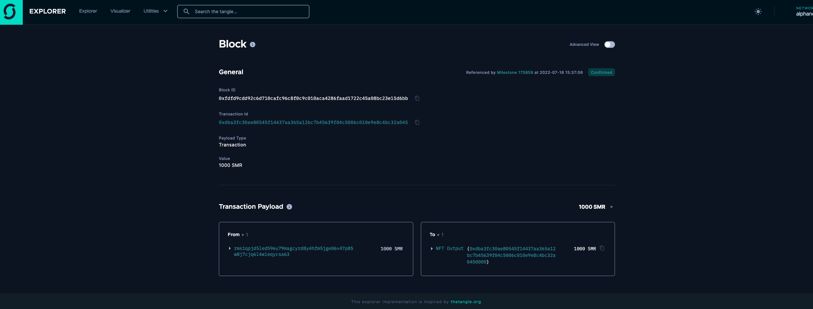
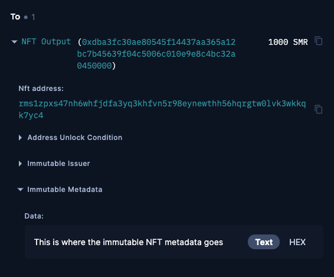
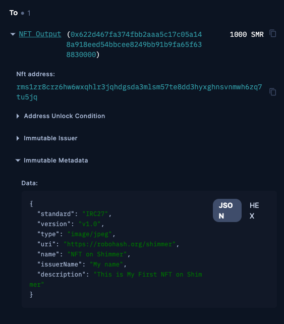

# How to Mint a Native NFT With Javascript on Shimmer

A non-fungible token (NFT) is a token that is verifiably unique and can be used to prove and transfer ownership of a digital asset. You can create NFTs in the Shimmer ledger as a native asset or use smart contracts as a smart asset. This tutorial uses Javascript to mint a native NFT in the Shimmer ledger.

## What you will learn

- How NFTs work on Layer 1 (L1)
- How you can mint an NFT
- How to use and read the Shimmer Explorer
- How the Immutable Metadata works

:::info
## Why we have iota.js and iota.rs with Node.js bindings
- iota.js can be used in the browser, this is not possible with the Node.js bindings on iota.rs
- iora.rs Node.js bindings are recommended to use in Node.js applications
- for wallet integrations, we recommend to use wallet.rs, which offers abstractions to handle IOTA payments and can optionally interact with IOTA Stronghold for seed
:::

And now, let's start with preparing the development environment. This tutorial assumes that you have Node.js installed.

## Setup Development Environment. 

First, let's copy the iota.js library to your computer, so we can run the example and go through it

```bash
git clone --branch feat/stardust https://github.com/iotaledger/iota.js shimmer-nft-example
```

Now let's switch to the example directory in our `mint-nft`example.
```bash
cd shimmer-nft-example/packages/iota/examples/mint-nft
```

Here you need to update the iota.js library for the Stardust update and install all the dependencies of the example.
```bash=
npm inpm install @iota/crypto.js@next @iota/iota.js@next @iota/util.js@next @iota/po
npm install
```

The next step is to compile the typescript Code into Javascript, so you can run it. To compile it, just run it into your console:

```bash=
npm run dist
```

This will create a new directory `dist` with a Javascript file called `ìndex.js`. You can run it by simple type this into your console:

```bash=
npm start
```

If you can read this prompt, your setup is complete and the script is running successfully.

> Target address (Bech32 encoded) where to mint the NFT or leave empty and we will generate an address for you: 

This means, you can input an address to create an NFT and mint it to a given address - so you can input an address by a friend or add an address from a Shimmer wallet. If you leave the address blank, the script will generate a temporary account and mint the NFT to the address of the temporary account.

## What is an NFT?

An NFT is short-term for Non Fungible Tokens - so it's a unique token that can represent a digital asset within its immutable data. This is a new decentral way to prove ownership and brings a lot of functionality and expandability which can be used in DApp and Games. An NFT can represent tangible assets like a house or a car or digital assets like a membership. The common use case is NFTs with linked Images, which often bring special membership, and access to private places.

Here in the tutorial, we will mint an NFT with a permanently linked image. The term `mint` means the process of creating a new NFT in the network. 


## Getting Started

The example leads us through the process of creating an NFT. We can mint for a specific address or mint one to a temporary account. Keep in mind, that this is just an example and should not be used to store NFTs in the Mainnet.  


So, let's assume you have already started the minting script - if now, just run this in your `mint-nft` example directory:

```bash=
npm start
```

Now, just hit Enter - and the script does some magic things. After a while, we created an NFT. 

Congratulations! You have now created your first Layer 1 NFT on Shimmer. How easy was that? 

But let's dive a bit deeper and discover the steps which did the magic.

You can see, after you hit Enter - the script created two addresses - a `target` address, where to send the NFT, and a `Sender`address, from which the NFT got sent. 

```bash
Target address (Bech32 encoded) where to mint the NFT or leave empty and we will generate an address for you: 
Target Address:
        Seed 5a8a3dfe32ddad4a72fd5f4644d1484c7c5363c0553c55dcd9af9bd74c295ef8
        Address Ed25519 0x85a1fa0740ff47eb1fda37da88c2f8f1dac2627e6be54fd1b7351bf90cda14f9
        Address Bech32 rms1qzz6r7s8grl506clmgma4zxzlrca4snz0e472n73ku63h7gvmg20j27zfve
Sender Address:
        Seed 6e6c7d96ef037ad7ddc8222ccd33a1c161cd4ab767dc660605f8e515a4248e5f
        Address Ed25519 0x64da7f2da173cf177d4608369c95ba7749232fd32be09e8e3cbd89035fabbf90
        Address Bech32 rms1qpjd5led59eu79magcyrd8y4hfm5jge06v47p85w8j7cjq6l4wleqycsa63
```

Now the script will request some test tokens by the faucet, create the NFT and send it to the `target` address. After some time, the script will output a link to the new Shimmer Network explorer, where you can find more information about the transaction within the NFT. 

Tip: If you need some Testnet tokens, you can use the [online faucet for Shimmer](https://faucet.alphanet.iotaledger.net/).

```bash
tputId:  0x3acd3f42a03d595cb9d134635ed67aa4721bdb4ccb15ef10ebb8646daabb04910000
To be consumed output:  {
  type: 3,
  amount: '1000000000',
  unlockConditions: [ { type: 0, address: [Object] } ]
}
Input:  {
  type: 0,
  transactionId: '0x3acd3f42a03d595cb9d134635ed67aa4721bdb4ccb15ef10ebb8646daabb0491',
  transactionOutputIndex: 0
}
Required Storage Deposit of the NFT output:  270500
Submitted blockId is:  0xfdfd9cdd92c6d710cafc96c8f0c9c010aca4286faad1722c45a08bc23e15d6bb
Check out the transaction at  https://explorer.alphanet.iotaledger.net/alphanet/block/0xfdfd9cdd92c6d710cafc96c8f0c9c010aca4286faad1722c45a08bc23e15d6bb
Done
```

You can click on the link, and discover the information on the Shimmer network Explorer. 



You can open the details on the NFT output to see the connected NFT Metadata. Just click on the `NFT Output`and the `Immutable Metadata` to view the data.




In this example, the data is a text called `This is where the immutable NFT metadata goes`. Let's discover what NFT Metadata is in detail and how you can add some custom Metadata and learn how other applications can use it.  

## NFT Metadata

You can define any data as **immutable metadata**, which will be stored in the Tangle. The community defined a standard for the metadata called [IRC27](https://github.com/iotaledger/tips/pull/65). This enables interoperability so the standardized metadata can be used by decentral applications like NFT marketplaces. 

This is a simple example of a IRC27 compatible metadata. 
```javascript=
const METADATA = {
    standard: "IRC27",
    version: "v1.0",
    type: "image/jpeg",
    uri: "https://robohash.org/shimmer",
    name: "NFT on Shimmer",
    issuerName: "My name",
    description: "This is My First NFT on Shimmer"
};
```

You can find a more complex example with royalties and NFT attributes in the [IRC27](https://github.com/iotaledger/tips/pull/65), but for us in the tutorial, the simple example is enough. 


### How to add Metadata to an NFT

For our example, we need to extend the code for our custom Metadata. For this, you need to open the source file in `src/index.ts` and we need to add 2 things, our Metadata Object and a converter to input the data into the transaction.

Add your metadata as a constant on line 35 below the EXPLORER, API_ENDPOINT, and FAUCET constants.
Please feel free to use another name, issuerName, description and uri of the image, so you will create your unique NFT.

```javascript=
const METADATA = {
    standard: "IRC27",
    version: "v1.0",
    type: "image/jpeg",
    uri: "https://robohash.org/shimmer",
    name: "NFT on Shimmer",
    issuerName: "My name",
    description: "This is My First NFT on Shimmer"
};
```

Now you need to convert the Javascript object into a Hex format, so the library can send the transaction.
To solve this, just replace line 106 with the following changes:

old
```javascript=
data: Converter.utf8ToHex("This is where the immutable NFT metadata goes", true)
```

new
```javascript=
data: Converter.utf8ToHex(JSON.stringify(METADATA), true)
```

After you have customized your NFT, you will need to compile the Typescript filet o Javascript again, and run the example:

```bash
npm run dist
npm start
```

**Expected output:** 

```bash
Required Storage Deposit of the NFT output:  342500
Submitted blockId is:  0x1e74f33313586cc2806776ee272deb65f140c2aafa53ce8040dea8c1820e1117
Check out the transaction at  https://explorer.alphanet.iotaledger.net/alphanet/block/0x1e74f33313586cc2806776ee272deb65f140c2aafa53ce8040dea8c1820e1117
Done
```


#### NFT with IRC27 compatible metadata




:::info
The maximum length of a Metadata field in the Shimmer Network is 8192 bytes and is defined in [TIP-22 (IOTA)](https://github.com/Wollac/protocol-rfcs/blob/protocol-parameters/tips/TIP-0022/tip-0022.md) or [TIP-32 (Shimmer)](https://github.com/iotaledger/tips/blob/shimmer-params/tips/TIP-0032/tip-0032.md)
:::

Minting must respect the following constraints:

 - _NFT ID_ must be zeroed out. The protocol will replace it with the blake2b-256 hash of the _Output ID_ upon booking.
 - _Issuer_ address must be unlocked on the input side.
 - _Immutable Metadata_ length must not exceed _Maximum Metadata Length_ defined in [TIP-22 (IOTA)](https://github.com/Wollac/protocol-rfcs/blob/protocol-parameters/tips/TIP-0022/tip-0022.md) or [TIP-32 (Shimmer)](https://github.com/iotaledger/tips/blob/shimmer-params/tips/TIP-0032/tip-0032.md).


