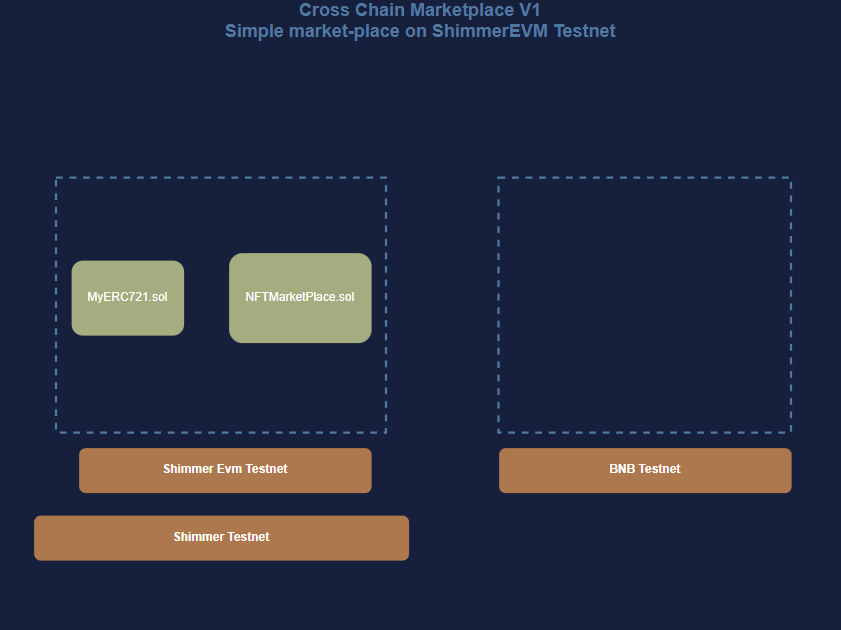
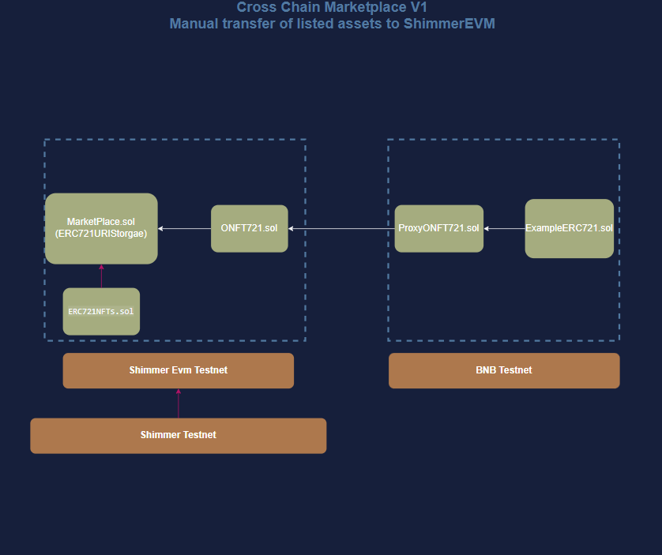
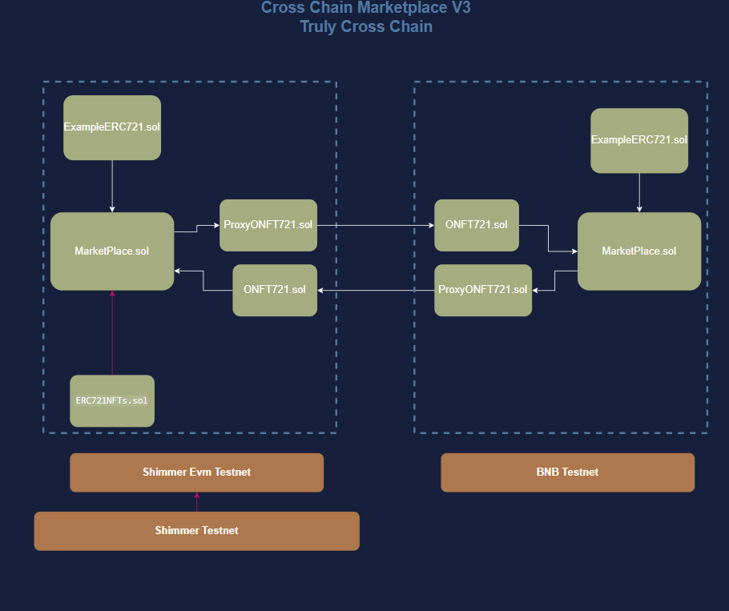

#  Cross-chain NFT Marketplace: Part I

This is the first part of a three-part series that will guide you as you build a cross-chain NFT marketplace using IOTA Smart Contracts (ISC). The marketplace will allow users to trade NFTs on the ShimmerEVM Testnet and BNB Testnet.

Part I will cover the setup of the project and the deployment of the NFT marketplace contract on the ShimmerEVM Testnet.
The second part of the series will focus on bridging NFTs from another EVM network, BNB Testnet, to the ShimmerEVM Testnet and listing them on the marketplace you created in part I.

Finally, in part III, you will deploy another instance of the marketplace on the BNB Testnet, making the marketplace truly cross-chain.

## Marketplace Architecture Overview
The architecture of the marketplace will evolve as we progress through the tutorials. 
### Part I
In part I, we will start with this very simple architecture:


### Part II
In Part II, you will add the contracts and scripts to manually bridge NFTs from the BNB Testnet to the ShimmerEVM Testnet and list them on the marketplace.  The architecture will evolve to look like this:


### Part III
Finally, in part III, you will deploy another marketplace instance on the BNB Testnet, where the contract will handle cross-chain transactions. 
This enables a user on the BNB Testnet, to view and buy an NFT listed on the ShimmerEVM Testnet and vice versa without switching networks.
The architecture will look like this:



## Prerequisites

- [Node.js](https://nodejs.org) >=  v18.0
- [Hardhat](https://hardhat.org) >= v2.0.0
- [npx](https://www.npmjs.com/package/npx)  >= v7.1.0.

## Set Up

First, create a new directory for the project and navigate into it:

```bash
mkdir cross-chain-nft-marketplace
cd cross-chain-nft-marketplace
```

Then [bootsrap a new Hardhat project](https://hardhat.org/tutorial/creating-a-new-hardhat-project), by running:

```bash
npx hardhat init
```

## Configuration

In the `hardhat.config.js` file, update the `networks` object to include the ShimmerEVM Testnet network configuration, as well as the BNB Testnet network configuration. 

```javascript reference
https://github.com/iota-community/ISC-Cross-Chain-NFT-Marketplace/blob/ab11866504fe8f72fc54d719a316ec9291839ced/hardhat.config.js
```


## Contracts

In the first part of the tutorial, you will only need two contracts: the [NFT Marketplace contract](https://github.com/iota-community/ISC-Cross-Chain-NFT-Marketplace/blob/ab11866504fe8f72fc54d719a316ec9291839ced/contracts/NFTMarketPlace.sol) and an [NFT ERC721-compatible](https://github.com/iota-community/ISC-Cross-Chain-NFT-Marketplace/blob/main/contracts/MyERC721.sol) contract.

Create a `contracts` folder in the root of the project and add the following files under it:

### NFTMarketplace.sol

The idea behind a marketplace contract is to allow users to list their NFTs for sale and other users to buy them. The contract will handle the transfer of the NFT from the seller to the buyer and the payment from the buyer to the seller. A seller must first allow the marketplace contract to transfer the NFT on their behalf before listing it for sale.

The main data structures and functions in the contract are:

- `struct Listing`  
Represents an NFT listing with the price and the address of the seller. In further parts of the tutorial, `struct Listing` will be expanded to include more details about the NFT being listed, like the chain it resides on.
```solidity
struct Listing {
    address seller;
    uint256 price;
}
```


- `mapping s_listings`  
Maps the token contract address to a mappring of token ID to `Listing`.
```solidity
mapping(address => mapping(uint256 => Listing)) private s_listings;
```


- `function listItem`  
Allows a seller to list an NFT for sale by specifying the token contract address, the token ID, and the price. In Part II, this function will stay the same, but the `Listing` struct will be expanded to include more details about the NFT being listed, like the chain it resides on.

```solidity
    /*
     * @notice Method for listing NFT
     * @param nftAddress Address of NFT contract
     * @param tokenId Token ID of NFT
     * @param price sale price for each item
     */
    function listItem(
        address nftAddress,
        uint256 tokenId,
        uint256 price
    )
        external
        notListed(nftAddress, tokenId)
        isOwner(nftAddress, tokenId, msg.sender)
    {
        if (price <= 0) {
            revert PriceMustBeAboveZero();
        }
        IERC721 nft = IERC721(nftAddress);
        if (nft.getApproved(tokenId) != address(this)) {
            revert NotApprovedForMarketplace();
        }
        s_listings[nftAddress][tokenId] = Listing(price, msg.sender);
        emit ItemListed(msg.sender, nftAddress, tokenId, price);
    }
```


- `function buyItem` 
This handles the transfer of an NFT from a seller to buyer. Same as the `listItem` function, this function will stay the same in Part II, because the NFTs will be bridged manually.

```solidity
    /*
     * @notice Method for buying listing
     * @notice The owner of an NFT could unapprove the marketplace,
     * which would cause this function to fail
     * Ideally you'd also have a `createOffer` functionality.
     * @param nftAddress Address of NFT contract
     * @param tokenId Token ID of NFT
     */
    function buyItem(address nftAddress, uint256 tokenId)
        external
        payable
        isListed(nftAddress, tokenId)
        // isNotOwner(nftAddress, tokenId, msg.sender)
        nonReentrant
    {
        // Challenge - How would you refactor this contract to take:
        // 1. Abitrary tokens as payment? (HINT - Chainlink Price Feeds!)
        // 2. Be able to set prices in other currencies?
        // 3. Tweet me @PatrickAlphaC if you come up with a solution!
        Listing memory listedItem = s_listings[nftAddress][tokenId];
        if (msg.value < listedItem.price) {
            revert PriceNotMet(nftAddress, tokenId, listedItem.price);
        }
        s_proceeds[listedItem.seller] += msg.value;
        // Could just send the money...
        // https://fravoll.github.io/solidity-patterns/pull_over_push.html
        delete (s_listings[nftAddress][tokenId]);
        IERC721(nftAddress).safeTransferFrom(listedItem.seller, msg.sender, tokenId);
        emit ItemBought(msg.sender, nftAddress, tokenId, listedItem.price);
    }

```


- `function getListing`  
gets an NFT listing by its address and `tokenId`.
```solidity
function getListing(address nftAddress, uint256 tokenId)
        external
        view
        returns (Listing memory)
    {
        return s_listings[nftAddress][tokenId];
    }
```


We have now covered all relevant parts of the contract for Part I, and how they would evolve in later steps. This is the full contract code for Part I:


```solidity reference
https://github.com/iota-community/ISC-Cross-Chain-NFT-Marketplace/blob/ab11866504fe8f72fc54d719a316ec9291839ced/contracts/NFTMarketPlace.sol
```

### MyERC721.sol

A standard ERC721-compatible contract that allows minting and transferring of NFTs, used as an example for the tutorial. The full contract code is as follows:

```solidity reference
https://github.com/iota-community/ISC-Cross-Chain-NFT-Marketplace/blob/main/contracts/MyERC721.sol
```

After adding the contracts, compile them by running:

```bash
npx hardhat compile
```


## Scripts

First, create a `scripts` folder in the root of the project and add the following files under it:

### deploy_marketplace_shimmer.js
The `deploy_marketplace_shimmer.js` script will deploy the NFTMarketplace contract to the ShimmerEVM Testnet and save the contract address to a file called `NFTMarketplace.txt`.

```javascript reference
https://github.com/iota-community/ISC-Cross-Chain-NFT-Marketplace/blob/main/scripts/deploy_marketplace_shimmer.js
```
This will deploy the NFTMarketplace contract to the ShimmerEVM Testnet and save the contract address to a file.
run it by executing:

```bash
npx hardhat run scripts/deploy_marketplace_shimmer.js --network shimmerevm-testnet
```

### deploy_er721_shimmer.js
This script will deploy the `MyERC721` contract to the ShimmerEVM Testnet and save the contract's address to a file called `MyERC721.txt`.

```javascript reference
https://github.com/iota-community/ISC-Cross-Chain-NFT-Marketplace/blob/main/scripts/deploy_erc721_shimmer.js
```
You can run this script with the following command:

```bash
npx hardhat run scripts/deploy_er721_shimmer.js --network shimmerevm-testnet
```

### mint_nft.js

After you have deployed the `MyERC721` contract, you are ready to mint an NFT using the following script:

```javascript reference
https://github.com/iota-community/ISC-Cross-Chain-NFT-Marketplace/blob/main/scripts/mint_nft.js
```
You can run the script by executing the following command:

```bash
npx hardhat run scripts/mint_nft.js --network shimmerevm-testnet
```
### approve_myERC721_for_marketplace.js

To allow the NFTMarketplace contract to transfer the NFT from the seller to the buyer, the seller must approve the marketplace contract to transfer the NFT on their behalf.
```javascript reference
https://github.com/iota-community/ISC-Cross-Chain-NFT-Marketplace/blob/main/scripts/approve_myERC721_for_marketplace.js
```
You can run the script by executing the following command:

```bash
npx hardhat run scripts/approve_myERC721_for_marketplace.js --network shimmerevm-testnet
```

### create_listing.js

After approving the NFT transfer, let's list the NFT for sale on the marketplace by running the following script:

```javascript reference
https://github.com/iota-community/ISC-Cross-Chain-NFT-Marketplace/blob/main/scripts/create_listing.js
```
You can run the script by executing the following command:

```bash
npx hardhat run scripts/create_listing.js --network shimmerevm-testnet
```

### buy_item.js

Finally, let's buy the NFT by running the following script:

```javascript reference
https://github.com/iota-community/ISC-Cross-Chain-NFT-Marketplace/blob/main/scripts/buy_item.js
```
You can run the script by executing the following command:

```bash
npx hardhat run scripts/buy_item.js --network shimmerevm-testnet
```


## Conclusion
In this first part of the cross-chain NFT marketplace tutorial, we have set up the project and deployed the NFTMarketplace contract to the ShimmerEVM Testnet. We have also deployed the MyERC721 contract, minted an NFT and then listed it on the marketplace. In the next part, we will manually bridge NFTs from BNB Testnet and Shimmer Testnet to the ShimmerEVM Testnet and list them on the same marketplace.