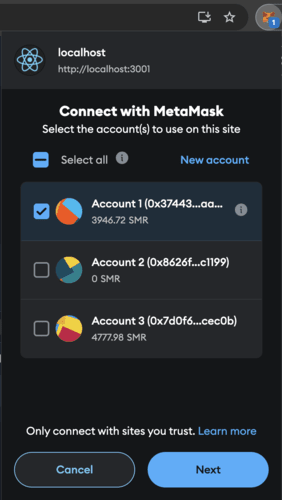
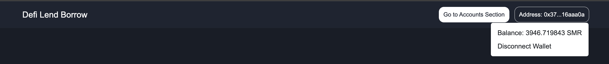

# DeFi Lend Borrow UI

## Part II 

This is a comprehensive guide to the DeFi Lend Borrow DApp, a decentralized application built using React and the ethers library. The DApp allows users to lend and borrow cryptocurrency assets on Shimmer EVM Testnet.

### Table of content

- [Prerequisites](#prerequisites)
- [Installation](#installation)
- [How to use](#how-to-use)
- [Code Structure](#code-structure)
- [Conclusion](#conclusion)


### Prerequisites

- [Node.js](https://nodejs.org) >=  v18.0
- [React.js](https://react.dev/) >= v18.2.0
- [npx](https://www.npmjs.com/package/npx)  >= v7.1.0.
- [Metamask](https://metamask.io/) : Set up a Metamask wallet with some Shimmer EVM testnet tokens.

### Installation

1. Clone the repository:
    ```bash
    git clone https://github.com/yourusername/defi-lend-borrow.git
    cd defi-lend-borrow/lend-borrow-ui
    ```
2. Install dependencies:
    ```bash
    npm install
    ```
    or
    ```bash
    npm install --legacy-peer-deps
    ```
3. Start the development server:
    ```bash
    npm start
    ```


### How to use

- Connect your Metamask wallet: Click the "Connect Wallet" button on the app to open the below metamask popup:
    
     

- View your account balance: See your current token balance.
     
- View the Dashboard component: 
     
  - In the Dashboard component you can view `total supplied` funds and `total borrowed` funds and the list of all the supported tokens with their details.
    
- `TransactionsCard` could be used by clicking any of the token mentioned on the list to `supply`, `borrow`, `repay` or `withdraw` funds.
        
  - Example of Supplying tokens below :
    - Enter the amount you want to supply and click transact.
    - First you will need to approve the underlying token to the contract.

        
    - And a new metamask popup will be shown to mint the eqvivalent amount of ITokens.

        

Similarly you can `borrow`, `repay` or `withdraw` funds.


### Component Structure

- `Context.js`: Defines the global context for web3 and other account data.
- `Components`: Contains below components for the UI :
    - `NavigationBar`
    - `LendBorrowPlatformDetails`
      - `AllAssetsList`
    - `TransactionsCard`
      - `Tabs`
      -  `TransactionsForm`
    - `AccountDetails`
    - `ConnectWallet`
    - `TransactionsAlert`
- `Utils`: 
    - Handles interactions with smart contracts using ethers.
    - Handle Js logics to manage the UI of the platform.

### Conclusion

This is the last document of DeFi Lend Borrow tutorial, in which we learn how to setup and use the react application to interact with the contracts we created in Part I.