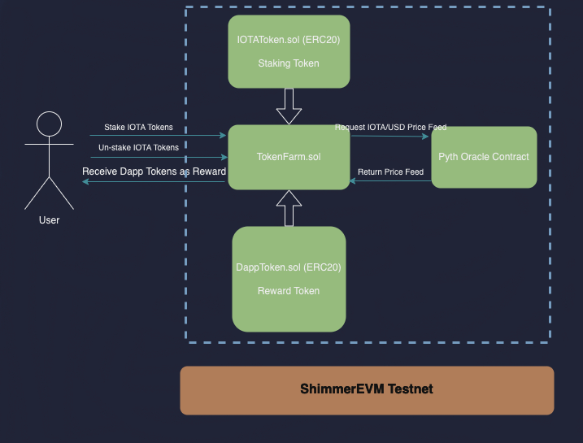

import DeployAdmonition from '../_admonitions/_deploy_a_smart_contract.md';

# Yield Farming DApp with Pyth Network Price Feeds

## Introduction

This tutorial will guide you through the process of building a basic yield farming decentralized application (DApp) using [Solidity](https://docs.soliditylang.org/en/v0.8.26/), the [Hardhat](https://hardhat.org/) development environment and the [Pyth Network Price Feeds](/build/oracles/#pyth) to retrieve the IOTA/USD price feed to calculate rewards for stakers.

## What is Yield Farming?

Yield farming, also known as liquidity mining, is a way for users to earn passive income by providing liquidity to a blockchain protocol. This involves depositing assets into a protocol, which in return offers rewards in the form of fees, interest, or other incentives. For example, users can supply liquidity to a decentralized lending platform or a decentralized exchange that operates on an Automated Market Maker (AMM) model, earning rewards in return.

At its core, yield farming allows cryptocurrency holders to lock up their assets, generating rewards in the process.

### Key Concepts Covered

1. **ERC20 Tokens**: Both the reward and staking tokens are standard ERC20 tokens.
2. **Staking Mechanism**: Users can deposit (stake) IOTATokens into the TokenFarm contract.
3. **Unstaking Mechanism**: Users can withdraw (unstake) their staked tokens at any time.
4. **Reward Distribution**: The contract periodically distributes DappTokens as rewards to stakers.

## Yield Farming Architecture Overview



## Prerequisites

- [Node.js](https://nodejs.org) >=  v18.0
- [Hardhat](https://hardhat.org) >= v2.0.0
- [npx](https://www.npmjs.com/package/npx)  >= v7.1.0.
- Basic understanding of Solidity and smart contracts.

## 1. Set Up the Hardhat Project

First, create a new directory for the project and navigate into it:

```bash
mkdir yield-farming
cd yield-farming
```

Then [bootsrap a new Hardhat project](https://hardhat.org/tutorial/creating-a-new-hardhat-project), by running:

```bash
npx hardhat init
```

Follow the prompts to create a basic sample project. After that, install the necessary dependencies:

```bash
npm install --save-dev @nomiclabs/hardhat-ethers ethers @openzeppelin/contracts dotenv
```

Pyth provides a [Solidity SDK](https://github.com/pyth-network/pyth-crosschain/tree/main/target_chains/ethereum/sdk/solidity) to fetch prices from Pyth contracts. The SDK exposes IPyth interface to interact with Pyth price feeds.

```bash
npm install @pythnetwork/pyth-sdk-solidity
```

## 2. Write and Understand the Smart Contracts

Create a `contracts` folder in the root of the project and add the following files under it:

### 1. DappToken.sol

#### Description

This contract represents the reward token (DappToken) that users will earn as a reward for staking their IOTATokens. It is an [ERC20](https://ethereum.org/en/developers/docs/standards/tokens/erc-20/) token, which is a widely used token standard on EVM compatible blockchains. The contract inherits from [OpenZeppelin’s](https://www.openzeppelin.com/) ERC20 implementation, which provides standard functionalities for a fungible token.

```solidity reference
https://github.com/iota-community/Defi-yield-farming/blob/main/contracts/DappToken.sol
```

#### Key Details

- The constructor mints an initial supply of 1,000,000 tokens to the deployer's address.
- The token is named "DappToken" with the symbol "DAP".

### 2. IOTAToken.sol

#### Description

This contract represents the token that users will stake in the yield farm (IOTAToken). Like the DappToken, this is also an [ERC20](https://ethereum.org/en/developers/docs/standards/tokens/erc-20/) token. The IOTAToken will be transferred to the TokenFarm contract when users stake their tokens.

```solidity reference
https://github.com/iota-community/Defi-yield-farming/blob/main/contracts/IOTAToken.sol
```

#### Key Details

- The constructor mints an initial supply of 1,000,000 tokens to the deployer's address.
- The token is named "IOTAToken" with the symbol "TST".

### 3. TokenFarm.sol

#### Description

This is the core contract of the yield farming application. It manages the staking, unstaking, and reward distribution logic. Users can stake their IOTATokens in this contract to earn DappTokens as rewards. The contract integrates with the Pyth Oracle to fetch the IOTA/USD price, which is used to calculate rewards for stakers.

#### Key Functionalities

- **Staking**: Users can stake their IOTATokens in the contract by calling the `stakeTokens` function. This function transfers the tokens from the user's wallet to the contract and updates their staking balance.
- **Unstaking**: Users can un-stake their tokens by calling the unstakeTokens function, which returns their tokens and resets their staking balance.
- **Rewards Distribution**: The contract owner can call the `issueTokens` function to distribute DappToken rewards to stakers. Rewards are issued once every 60 minutes, and the reward rate is 10% of the staked amount.

#### Key Variables

- `dappToken` and `iotaToken`: Instances of the DappToken and IOTAToken contracts, used for staking and rewarding tokens.
- `stakingBalance`: A mapping to track each user's staked IOTATokens.
- `stakers`: An array that keeps track of all users who have staked tokens.
- `hasStaked` and `isStaking`: Mappings to track whether a user has staked before and whether they are currently staking.

#### Functions

- `stakeTokens(uint256 _amount)`: Allows users to stake IOTATokens in the contract.
- `unstakeTokens()`: Allows users to withdraw their staked IOTATokens.
- `issueTokens()`: Allows the owner to distribute DappToken rewards to all stakers.
- `getIOTA2USDPriceFeed`: Interacts with the Pyth Oracle network to fetch the current price of IOTA in USD. This fetched price is used within the `issueTokens` function to calculate the equivalent value of rewards in DappToken.

```solidity reference
https://github.com/iota-community/Defi-yield-farming/blob/main/contracts/TokenFarm.sol
```

## 3. Create a HardHat Deploy Script

Create a deployment script to deploy the contracts to the Shimmer EVM testnet.

In the `scripts` folder, create a file named `deploy.js` with the following content:

```javascript reference
https://github.com/iota-community/Defi-yield-farming/blob/main/scripts/deploy.js
```

## 4. Deploy to the Shimmer EVM Test

### 1. Configure Hardhat for Shimmer EVM Testnet

Create a `.env` file with the following content, replacing your own private key:

```bash
PRIVATE_KEY=your-private-key
SHIMMER_EVM_TESTNET_URL=https://json-rpc.evm.testnet.shimmer.network
```

### 2. Install the `dotenv` Package to Manage Environment Variables

```bash
npm install dotenv
```

### 3. Import the `dotenv` package in your `hardhat.config.js`

Modify `hardhat.config.js` to include the Shimmer EVM testnet configuration:

```javascript reference
https://github.com/iota-community/Defi-yield-farming/blob/main/hardhat.config.js
```

## 5. Deploy to Shimmer EVM Testnet

<DeployAdmonition />

### 1. Compile Your Contracts

```bash
npx hardhat compile
```

### 2. Deploy Your Contracts to the Shimmer EVM Testnet

```bash
npx hardhat run scripts/deploy.js --network shimmer_evm_testnet
```

You can verify your contract by visiting
the [Shimmmer EVM Testnet Explorer](https://explorer.evm.testnet.shimmer.network/),
and searching for the address from the previous step. If you access the `Contract` tab, you should be able to see your code and interact with your contract or you can use the below command to verify the contracts through hardhat :

```bash
npx hardhat verify --network shimmer_evm_testnet CONTRACT_ADDRESS_HERE "CONSTRUCTOR_ARGUMENTS_IF_ANY"
```

Feel free to [fork this repository](https://github.com/iota-community/Defi-yield-farming), contribute with pull requests, or customize it to suit your needs. We have a React [frontend](https://github.com/iota-community/Defi-yield-farming/tree/main/frontend) on the repository that you can use to interact with Token Farm smart contract.