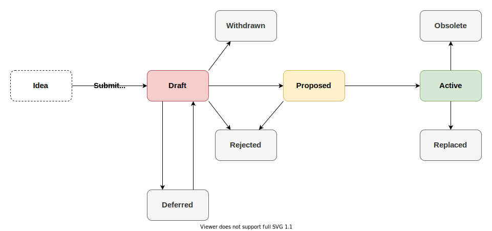

## Abstract

A Tangle Improvement Proposal (TIP) is a design document providing information to the IOTA community, or describing a new feature for IOTA or its processes or environment. The TIP should provide a concise technical specification of the feature and a rationale for the feature.

TIPs are the primary mechanism for proposing new features and standards to the IOTA protocol and related applications, furthermore for collecting input from the wider community and documenting the design decisions that go into the IOTA technology.

TIPs are maintained as text files inside the repository, therefore the history and evolution of protocol features are transparent and well documented.

This TIP defines the TIP Process itself to establish a common way of working.

## Motivation

The motivation of this TIP is to create a public platform to discuss improvement ideas related to the IOTA technology and define an easy-to-follow process of contributing to their development and implementation.

## Specification

### TIP Types

There are 3 types of TIPs:
 - A **Standards Track TIP** describes any change that affects most or all IOTA node implementations, such as a change to the network protocol, a change in transaction validity rules, or any change or addition that affects the interoperability of applications using IOTA. Standards Track TIPs consist of two parts, a design document and a reference implementation. Standards Track TIPs can be broken down into layers:
   - **Core**: includes improvements requiring a consensus fork (e.g. new transaction validation rules, change in protocol message layouts), as well as any change that concerns the protocol specification.
   - **Networking**: includes improvements around the networking layer of the network, e.g. gossip protocol or autopeering.
   - **Interface**: includes improvements around the client APIs of base layer nodes as well as around the interface definitions of IOTA Smart Contracts (ISC), such as contract schemas or ISC node APIs.
   - **IRC**: includes improvements around application-level standards and conventions such as contract standards, token standards or metadata format standards.
 - An **Informational TIP** describes an IOTA design issue, or provides general guidelines or information to the IOTA community, but does not propose a new feature. Informational TIPs do not necessarily represent an IOTA community consensus or recommendation, so users and implementors are free to ignore Informational TIPs or follow their advice.
 - A **Process TIP** describes a process surrounding IOTA, or proposes a change to (or an event in) a process. Process TIPs are like Standards Track TIPs but apply to areas other than the IOTA protocol itself. They may propose an implementation, but not to IOTA's codebase; they often require community consensus; unlike Informational TIPs, they are more than recommendations, and users are typically not free to ignore them. Examples include procedures, guidelines, changes to the decision-making process, and changes to the tools or environment used in IOTA development.

It is highly recommended that a TIP outlines a single key proposal, idea or feature; the narrower the scope of the TIP is, the easier it becomes to reach consensus on the proposed feature and incorporate it into the protocol. Several TIPs can form a bundle of changes when linked to each other.

### TIP Format and Structure

TIPs must adhere to the format and structure requirements that are outlined in this document. A TIP is written in [Markdown](https://docs.github.com/en/github/writing-on-github/getting-started-with-writing-and-formatting-on-github/basic-writing-and-formatting-syntax) format and should have the following parts (optional parts are marked with a *):

| Name | Description |
| ---- | ----------- |
| Preamble | [RFC 822](https://www.ietf.org/rfc/rfc822.txt) style headers containing metadata about the TIP, including the TIP number, a short descriptive title (limited to a maximum of 44 characters), a description (limited to a maximum of 140 characters), and the author details. Irrespective of the category, the title and description should not include TIP number. [See below](#tip-header-preamble) for details. |
| Abstract | A short summary of the technical issue being addressed by the TIP. |
| Motivation |  A motivation section is critical for TIPs that want to change the IOTA protocol. It should clearly explain why the existing protocol specification is inadequate to address the problem that the TIP solves. TIP submissions without sufficient motivation may be rejected outright. |
| Specification | The technical specification should describe the syntax and semantics of any new feature. The specification should be detailed enough to allow competing, interoperable implementations for any of the current IOTA platforms. |
| Rationale | The rationale fleshes out the specification by describing what motivated the design and why particular design decisions were made. It should describe alternate designs that were considered and related work, e.g. how the feature is supported in other languages. The rationale may also provide evidence of consensus within the community, and should discuss important objections or concerns raised during discussion. |
| Backwards Compatibility* | All TIPs that introduce backwards incompatibilities must include a section describing these incompatibilities and their severity. The TIP must explain how the author proposes to deal with these incompatibilities. TIP submissions without a sufficient backwards compatibility treatise may be rejected outright. |
| Test Cases* | Test cases for an implementation are mandatory for TIPs that are affecting consensus changes. Tests should either be inlined in the TIP as data or placed in the TIP folder. |
| Reference Implementation* | An optional section that contains a reference/example implementation that people can use to assist in understanding or implementing this specification. |
| Copyright |  All TIPs must be in the public domain. See the bottom of this TIP for an example copyright waiver. |

### TIP Template

The template to follow for new TIPs is located in the [repository](https://github.com/iotaledger/tips/blob/main/tip-template.md).

### TIP Process

Parties involved in the process are:
 - _TIP author_: you, the champion who proposes a new TIP. It is the responsibility of the _TIP author_ to drive the progression of the TIP to `Active` status. This includes initiating public discussion and implementing the proposal as well.
 - _TIP editor_: they deal with administering the TIP process and ensure process requirements are fulfilled.
 - _Technical Committee_: technical experts of IOTA who evaluate new TIPs, provide feedback and ensure that only sound and secure features are added to the protocol.
 
#### TIP Statuses

The status of the TIP describes its current stage in the TIP process.

| Status | Description |
| ------ | ----------- |
| Idea | An idea for an improvement to the IOTA technology. Not yet tracked as an official TIP. |
| Draft | The idea has been formally accepted in the repository, and is being worked on by its authors. |
| Proposed | The TIP has a working implementation and has clear plans on how to progress to `Active` status.|
| Active | The TIP is deployed to the main network or some TIP specific adoption criteria has been met. |
| Deferred | The _TIP author(s)_ are not working on the TIP currently, but plan to continue in the future. TIP is on hold. |
| Rejected | The TIP is rejected. |
| Withdrawn | The TIP has been withdrawn by the _TIP author(s)_. |
| Replaced | The TIP is replaced by a newer TIP. Must point to the new TIP in the header.|
| Obsolete | The TIP is rendered obsolete by some future change.  |

#### TIP Workflow

_How are new proposal get added to the protocol?_

1. All TIPs begin life as an `Idea` proposed in the public [IOTA discussion forum, that is the GitHub Discussion page of the TIP repository](https://github.com/iotaledger/tips/discussions). A public, open discussion should predate any formal TIP submission. If you want to propel your proposal to acceptance, you should make sure to build consensus and support in the community around your proposed changes already in the idea stage.

2. Once the idea has been vetted, your next task is to submit a `Draft` TIP to the TIP repository as a pull request. Do not assign a TIP number yet to the draft, but make sure that the proposal is technically sound and follows the format and style guides of the TIP Process. Create a sub-folder under `tips` folder with the title of the draft (`tips/title_of_draft/`) and put all assets in this folder.

3. A _TIP editor_ reviews your PR and assigns a TIP number to the draft.

4. The _Technical Committee_ as well as the broader public evaluate the draft proposal and might ask for modifications or clarifications. The proposal can only be merged into the repository as a draft if it represents a net improvement and does not complicate the protocol unduly.

5. The TIP is merged into the repo with `Draft` status by _TIP editor/author_.

6. When a working implementation is presented and there are clear plans on how to progress the TIP to  completion, the _TIP author_ submits a subsequent PR that links its implementation to the TIP and progresses it to `Proposed` stage. The TIP is ready to be deployed on testnet.

7. When a `Proposed` TIP is deemed to have met all appropriate criteria and its implementation has been demonstrated to work reliably in testnet environment, it is ready to be moved to the main network. Upon deployment, the TIP status must change to `Active`.

_How can a TIP transition from one status to another?_

A `Draft` TIP might be moved to `Deferred` status by the _TIP author(s)_ when they are no longer working on the proposal, but plan to continue it in the future.

A `Draft` TIP might be moved to `Withdrawn` status by the _TIP author(s)_.

A `Draft` TIP might be moved to `Rejected` status by _TIP editor(s)_ or _Technical Committee_ if it does not meet the appropriate TIP criteria, or no relevant progress has been demonstrated on the TIP for at least 3 years.

A `Draft` TIP might be moved to `Proposed` status by TIP author(s) if it is considered complete, has a working implementation and clear plans on how to progress it to `Active` status.

A `Proposed` TIP might be moved to `Active` status if a TIP specific adoption criteria has been met. For Core TIPs this means deployment on the main network.

A `Proposed` TIP might be moved to `Rejected` status by _TIP editor(s)_ or _Technical Committee_ if its implementation puts unduly burden and complexity on the protocol, or other significant problems are discovered during testing.

An `Active` TIP might be moved to `Replaced` status by a newer TIP. The replaced TIP must point to the TIP that replaces it.

An `Active` TIP might be moved to `Obsolete` status when the feature is deprecated.

_How to champion the TIP Process as a TIP author?_

 - Browse the [idea discussion forum](https://github.com/iotaledger/tips/discussions) before posting a new TIP idea. Someone else might already have proposed your idea, or a similar one. Take inspiration from previous ideas and discussions.
 - It is your responsibility as a _TIP author_ to build community consensus around your idea. Involve as many people in the discussion as you can. Use social media platforms, Discord or Reddit to raise awareness of your idea.
 - Submit a draft TIP as a PR to the TIP repository. Put extra care into following TIP guidelines and formats. TIPs must contain a link to previous discussions on the topic, otherwise your submissions might be rejected. TIPs that do not present convincing motivation, demonstrate lack of understanding of the design's impact, or are disingenuous about the drawbacks or alternatives tend to be poorly-received.
 - Your draft TIP gets a TIP number assigned by a _TIP editor_ and receives review and feedback from the larger community as well as from the _Technical Committee_. Be prepared to revise your draft based on this input.
 - TIPs that have broad support are much more likely to make progress than those that don't receive any comments. Feel free to reach out to the _TIP editors_ in particular to get help to identify stakeholders and obstacles.
 - Submitted draft TIPs rarely go through the process unchanged, especially as alternatives and drawbacks are shown. You can make edits, big and small, to the draft TIP to clarify or change the design, but make changes as new commits to the pull request, and leave a comment on the pull request explaining your changes. Specifically, do not squash or rebase commits after they are visible on the pull request.
 - When your draft TIP PR gets enough approvals from _TIP editors_ and _Technical Committee_ members, it can be merged into the repository, however, your job is far from complete! To move the draft into the next status (proposed), you have to demonstrate a working implementation of your TIP. For Core TIPs, seek help from protocol developers and/or client teams to coordinate the feature implementation. For IRCs for example you need to provide their implementation yourself.
 - You also need to present a clear plan on how the TIP will be moved to the `Active` status, by for example agreeing on a TIP deployment strategy with the _Technical Committee_ or core developers.
 - To move your `Draft` TIP to the `Proposed` phase, submit a subsequent PR that links its implementation and devises its route to become `Active`. The latter might be an additional document in the TIP's folder, a link to a public discussion or a short description or comment on the PR itself.
 - To move your `Proposed` TIP to `Active` status you need to demonstrate that it has met its specific adoption criteria. For Core TIPs, this means that majority of network nodes support it. For other TIPs, especially for IRCs, adoption might mean that the standard is publicly available, well documented and there are applications building on it.

### TIP Header Preamble

Each TIPs must have an RFC 822 style header preamble preceded and followed by three hyphens (---). The headers must appear in the following order. Headers marked with "*" are optional and are described below. All other headers are required.

| Field | Description |
| ----- | ----------- |
| `tip` | TIP number, or "?" before being assigned (assigned by _TIP editor_) |
| `title` | Few words describing the TIP, maximum 44 characters |
| `description*` | One full short sentence |
| `author` | A comma separated list of the author's or authors' name + GitHub username (in parenthesis), or name and email (in angle brackets). Example, FirstName LastName (@GitHubUsername), FirstName LastName <foo@bar.com>, FirstName (@GitHubUsername) and GitHubUsername (@GitHubUsername) |
| `discussions-to*` | The url pointing to the official discussion thread |
| `status` | Current status of the TIP. One of: `Draft`, `Proposed`, `Active`, `Deferred`, `Rejected`, `Withdrawn`, `Obsolete` or `Replaced` |
| `type` |  TIP type, one of: `Standards Track`, `Process` or `Informational` |
| `layer*` | Only for Standards Track, defines layer: `Core`, `Networking`, `Interface` or `IRC`  |
| `created` | Date created on, in ISO 8601 (yyyy-mm-dd) format |
| `requires*` | Link dependent TIPs by number |
| `replaces*` | Older TIP being replaced by this TIP |
| `superseded-by*`| Newer TIP replaces this TIP |
| `withdrawal-reason*`| A sentence explaining why the TIP was withdrawn. (Optional field, only needed when status is `Withdrawn`) |
| `rejection-reason*`| A sentence explaining why the TIP was rejected. (Optional field, only needed when status is `Rejected`) |

### Linking TIPs
References to other TIPs should follow the format TIP-N where N is the TIP number you are referring to. Each TIP that is referenced in an TIP MUST be accompanied by a relative Markdown link the first time it is referenced, and MAY be accompanied by a link on subsequent references. The link MUST always be done via relative paths so that the links work in this GitHub repository or forks of this repository. For example, you would link to this TIP with `[TIP-1](../TIP-0001/tip-0001.md)`.

### Auxiliary Files
Images, diagrams and auxiliary files should be included in the subdirectory of the TIP.  When linking to an image in the TIP, use relative links such as `[TIP Process Diagram](../TIP-0001/process.png)`.

### Transferring TIP Ownership

It occasionally becomes necessary to transfer ownership of TIPs to a new champion. In general, we'd like to retain the original author as a co-author of the transferred TIP, but that's really up to the original author. A good reason to transfer ownership is because the original author no longer has the time or interest in updating it or following through with the TIP process, or has fallen off the face of the 'net (i.e. is unreachable or isn't responding to email). A bad reason to transfer ownership is because you don't agree with the direction of the TIP. We try to build consensus around a TIP, but if that's not possible, you can always submit a competing TIP.

If you are interested in assuming ownership of a TIP, send a message asking to take over, addressed to both the original author and the _TIP editors_. If the original author doesn't respond to the email in a timely manner, the _TIP editors_ will make a unilateral decision (it's not like such decisions can't be reversed :)).

### TIP Editors

The current TIP editors are:
 - Kumar Anirudha (@anistark, kumar.anirudha@iota.org)
 - Levente Pap (@lzpap, levente.pap@iota.org)

### TIP Editor Responsibilities

TIP editors' essential role is to assist and guard the process of contributing to the IOTA ecosystem, provide help and directions to community members as well as to external contributors. If you have a question regarding the TIP process, reach out to them, they will point you to the right direction.

They ensure that only quality contributions are added as TIPs, provide support for TIP authors, furthermore monitor that the TIP process is fair, objective and well documented.

For each new TIP that comes in, an editor does the following:
 - Read the TIP to check if it is ready: sound and complete. The ideas must make technical sense, even if they don't seem likely to get to `Active` status.
 - The title should accurately describe the content.
 - Check the TIP for language (spelling, grammar, sentence structure, etc.), markup (GitHub flavored Markdown), code style.

If the TIP isn't ready, the editor will send it back to the author for revision, with specific instructions.

Once the TIP is ready to be merged as a draft, the editor will:
 - Assign a TIP number that does not conflict with other TIP numbers. It might be the PR number, but might also be selected as the next unused TIP number in line.
 - Merge the corresponding pull request.
 - Send a message back to the TIP author with the next step.

The editors don't pass judgment on TIPs. We merely do the administrative & editorial part.

### Technical Committee

The _Technical Committee_ consists of several core contributors of the IOTA ecosystem and core developers. Their job is to evaluate technical details of TIPs, judge their technical feasibility and safeguard the evolution of the protocol. Core improvement ideas must be carefully thought through and their benefits must outweigh their drawbacks.

In order for a draft TIP to be accepted into the repo, it must be signed-off by the _Technical Committee_. It is also the committee that gives the green light for drafts to become proposed or active.

## Rationale

The TIP process is intended to replace the formerly adopted RFC process to achieve:
 - Simpler workflow and less rigid process structure,
 - Broader platform for ideation and early phase improvement discussions,
 - A layered protocol specification approach that can describe not only core components, but also higher layer protocols and application-level conventions.

In order not to reinvent the wheel, the TIP Process draws heavily on the [BIP](https://github.com/bitcoin/bips/blob/master/bip-0002.mediawiki) and [EIP](https://github.com/ethereum/EIPs/blob/master/EIPS/eip-1.md) processes.

## Backwards Compatibility
 - The current `iotaledger/protocol-rfcs` repository will be renamed to `iotaledger/tips`.
 - Merged RFCs will receive a TIP number and header with `Active` status.
 - PRs in the repo will be mapped as `Draft` TIPs, either modifications to existing TIPs or new ones.
 - The GitHub Discussion page of the repository will be restructured to accommodate TIP idea discussions.

## References
 - [BIP-1](https://github.com/bitcoin/bips/blob/master/bip-0001.mediawiki) and[ BIP-2](https://github.com/bitcoin/bips/blob/master/bip-0002.mediawiki), Bitcoin Improvement Proposal Purpose and Guidelines
 - [EIP-1](https://github.com/ethereum/EIPs/blob/master/EIPS/eip-1.md), Ethereum Improvement Proposal Purpose and Guidelines
 - [CIP-1](https://github.com/cardano-foundation/CIPs/tree/master/CIP-0001), Cardano Improvement Proposal Process

## Copyright

Copyright and related rights waived via [CC0](https://creativecommons.org/publicdomain/zero/1.0/).
