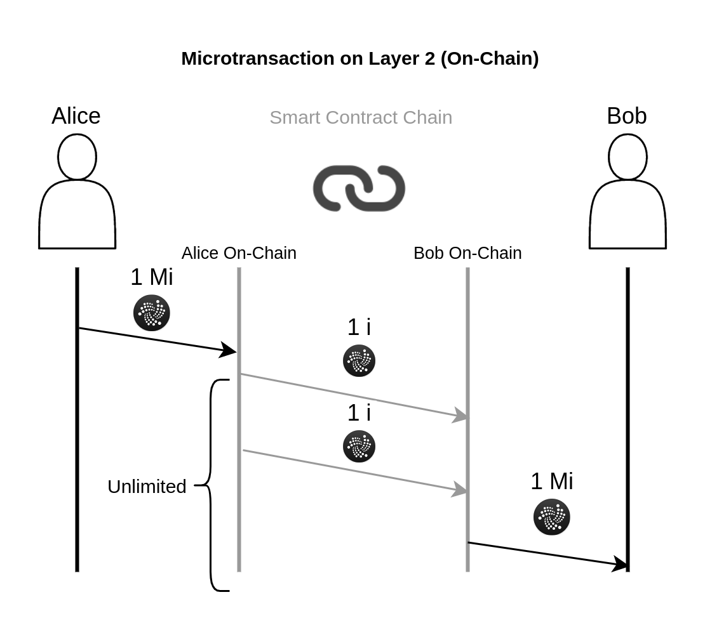

## Summary

The current `dust protection` in `chrysalis-pt2` is only an intermediate solution to prevent attacks or misbehavior that could bloat the ledger database. The design has several drawbacks, e.g. it does not scale, relies on a total ordering of the tangle and it is rather complicated to use from a user point of view.

This document describes a new `dust protection` concept, called `storage deposit`, which solves the mentioned drawbacks and creates a monetary incentive to keep the ledger state small. It focuses on the underlying problem, the increase in database size, instead of artificially limiting the number of UTXOs. This is achieved by enforcing a minimum IOTA coin deposit in every output based on the actually used disc space of the output itself.

## Motivation

In a distributed ledger network, every participant, a so-called node, needs to keep track of the current ledger state. Since `chrysalis-pt2`, the IOTA ledger state is based on the UTXO model, where every node keeps track of all the currently unspent outputs. Without `dust protection`, even outputs containing only one single IOTA coin are valid and therefore stored in the database.

Misusage by honest users or intentionally bad behavior by malicious actors can lead to growing database and snapshot sizes and increasing computational costs (database lookups, balance calculations). Due to these increasing hardware requirements, the entry barrier to participate in the network becomes unaffordable and less nodes would operate the network.

Especially in a fee-less system like IOTA, this is a serious issue, since an attacker can create a lot of damage with low effort. Other DLTs do not yet face this problem, as such an attack would be much more expensive due to the high transaction fees.
However, in order to solve scalability issues more and more transactions need to be handled. Therefore, other DLT projects will also eventually run into the same dust limitations. This document proposes to introduce `storage deposit` to address this.

## Requirements

- The maximum possible ledger database size must be limited to a reasonable and manageable size.
- The `dust protection` must not depend on a global shared state of the ledger, so that transaction validation can happen in parallel.
- The `dust protection` should work for outputs with arbitrary data and size.
- The ledger database size should be fairly allocated to users based on the scarce resource, IOTA coins.

## Detailed Design

The current `dust protection` solution in `chrysalis-pt2` does not satisfy the mentioned requirements for the following reasons:

- The enforced maximum limit of disc space is ~6.5 TB.
- The dust allowance mechanism depends on the total amount of funds in `DustAllowanceOutput` per address, which is a global shared state.
- It is designed for one fixed output size.

Therefore, a new transaction validation rule is introduced which replaces the former `dust protection` solution completely.

Blocks including payloads, even transaction payloads, are considered to be pruned by the nodes, but unspent transaction outputs must be kept until they are spent. Therefore the `dust protection` is based on the unspent outputs only.

**Every output created by a transaction needs to have at least a minimum amount of IOTA coins deposited in the output itself, otherwise the output is syntactically invalid.**

min_deposit_of_output = ⌊v_byte_cost · v_byte⌋  
v_byte = ∑(weight𝑖 · byte_size𝑖) + offset

where:
- v_byte_cost: costs in IOTA coins per virtual byte
- weight𝑖: factor of field 𝑖 that takes computational and storage costs into account
- byte_size𝑖: size of field 𝑖 in bytes
- offset: additional v_bytes that are caused by additional data that has to be stored in the database but is not part of the output itself

| :warning: `min_deposit_of_output` is rounded down |
| ------------------------------------------------- |

Starting with the tokenization and smart contracts mainnet upgrade, new [output types are introduced by TIP-18](../TIP-0018/tip-0018.md) that contain mandatory and optional fields with variable length. Each of these fields result in different computational and storage costs, which will be considered by the positive `weight_i`. The size of the field itself is expressed with `byte_size_i`. `offset` is used to take the overhead of the specific output itself into account.

The `v_byte_cost` is a protocol value, which has to be defined based on reasonable calculations and estimates.

**In simple words, the more data you write to the global ledger database, the more IOTA you need to deposit in the output.**
This is not a fee, because the deposited coins can be reclaimed by consuming the output in a new transaction.

### Advantages

The proposed solution has several advantages over the former solution.

First of all, the database size is limited to an absolute maximum size. Since the total supply of IOTA coins stays constant, also the maximum amount of `v_bytes` that can ever be written to the database remains constant.

Total ordering of the tangle is not necessary because there is no shared global ledger state for transaction validation anymore. The node can determine if the transaction is valid and the dust protection rules are fulfilled, just by looking at the transaction itself. Therefore this solution is also suitable for IOTA 2.0.

By introducing a certain cost for every byte stored in the ledger, it is possible to store arbitrary data in the outputs, as long as enough IOTA coins are deposited in the output itself to keep the information retained. This enables permanent storage of data in a distributed and decentralized way, without the need of a permanode.

Users have an economic incentive to clean up the database. By consuming old unused outputs, users can reclaim their deposited IOTA coins.

### Drawbacks

This solution prevents seamless microtransactions, which are a unique selling point for IOTA, because the issuer of the transaction always needs to deposit `min_deposit_of_output` IOTA coins in the output created by the transaction. This minimum deposit will have a higher value than the microtransaction itself, which basically makes microtransactions impossible. Two different solutions to circumvent this obstacle are introduced [here](#Microtransactions).

### How does it affect other parts of the protocol?

The `dust protection` only affects "value-transactions". Since blocks containing other payloads are not stored in the ledger state and are subject to pruning, they cannot cause permanent "dust" and do not need to be considered for `dust protection`.
However, all output types like e.g. smart contract requests are affected and must comply with the `min_deposit_of_output` criteria. Therefore, these requests could get quite expensive for the user, but the same mechanism introduced for [Microtransactions on Layer 1](#Microtransactions-on-Layer-1) can be utilized for smart contract requests as well.

### Byte cost calculations

To limit the maximum database size, the total IOTA supply needs to be divided by the target database size in bytes to get the worst case scenario regarding the byte costs.

However, in this scenario no outputs hold more IOTA coins than required for the `dust protection`. This does not represent the real distribution of funds over the UTXOs. We could assume that these output amounts follow Zipf's law. Unfortunately, fitting a Zipf distribution to the current ledger state will not match the future distribution of the funds for several reasons:

- There is already another `dust protection` in place, which distorts the distribution.
- With new use cases enabled by the new `dust protection` (e.g. tokenization, storing arbitrary data in the ledger), the distribution will dramatically change.
- Fittings for other DLT projects do not match because there are transaction fees in place, which decrease the amount of dust outputs in the distribution.

Another possibility would be to estimate how much percentage of the database will be used for outputs with minimum required deposit (`fund sparsitiy percentage`) in the future. The remaining IOTA coins can be ignored in that case to simplify the calculation. Since a fund sparsity percentage of less than 20% would already be bad for other upcoming protocol features like the mana calculation, we could take this value for our calculation instead of the worst case.

### Weights for different outputs

The different output types mentioned in the [Output Types TIP-18](../TIP-0018/tip-0018.md) contain several mandatory and optional fields. Every field itself creates individual computational and storage requirements for the node, which is considered by having different weights for every field.

##### Field types

The following table describes different field types in an output:

<table>
    <tr>
        <th>Name</th>
        <th>Description</th>
        <th>Weight</th>
        <th>Reasoning</th>
    </tr>
    <tr>
        <td><code>key</code></td>
        <td>Creates a key lookup in the database.</td>
        <td>10.0</td>
        <td>Keys need to be stored in the LSM tree of the key-value database engine and need to be merged and leveled, which is computational-, memory- and read/write IO-wise a heavy task.</td>
    </tr>
    <tr>
        <td><code>data</code></td>
        <td>Plain binary data on disk.</td>
        <td>1.0</td>
        <td>Data is stored as the value in the key-value database, and therefore only consumes disc space.</td>
    </tr>
</table>

| :warning:  Protocol parameters are not set yet |
| ---------------------------------------------- |

Protocol parameters presented in this document are design parameters that will change in the future based on simulation results, benchmarking and security assumptions. The reader should not take these values as definitive.

An example of such parameter for example is the `weight` assigned to different output field types.

#### Outputs

The following tables show the different outputs including the possible fields and their specific weight.

<table>
    

        
Basic Output

        <blockquote>
            Describes a basic output with optional features.
        </blockquote>
        <table>
            <tr>
                <td>Offset</td>
                <td>
                    <table>
                        <tr>
                            <td><b>Field</b></td>
                            <td><b>Field type</b></td>
                            <td><b>Length Minimum</b></td>
                            <td><b>Length Maximum</b></td>
                            <td><b>Description</b></td>
                        </tr>
                        <tr>
                            <td>OutputID</td>
                            <td><code>key</code></td>
                            <td>34</td>
                            <td>34</td>
                            <td>The ID of the output.</td>
                        </tr>
                        <tr>
                            <td>Block ID (included)</td>
                            <td><code>data</code></td>
                            <td>32</td>
                            <td>32</td>
                            <td>The ID of the block in which the transaction payload that created this output was included.</td>
                        </tr>
                        <tr>
                            <td>Confirmation Milestone Index</td>
                            <td><code>data</code></td>
                            <td>4</td>
                            <td>4</td>
                            <td>The index of the milestone which confirmed the transaction that created the output.</td>
                        </tr>
                        <tr>
                            <td>Confirmation Unix Timestamp</td>
                            <td><code>data</code></td>
                            <td>4</td>
                            <td>4</td>
                            <td>The unix timestamp of the milestone which confirmed the transaction that created the output.</td>
                        </tr>
                    </table>
                </td>
            </tr>
            <tr>
                <td>Fields</td>
                <td>
                    <table>
                        <tr>
                            <td><b>Name</b></td>
                            <td><b>Field type</b></td>
                            <td><b>Length Minimum</b></td>
                            <td><b>Length Maximum</b></td>
                            <td><b>Description</b></td>
                        </tr>
                        <tr>
                            <td>Output Type</td>
                            <td><code>data</code></td>
                            <td>1</td>
                            <td>1</td>
                            <td>
                                Set to <strong>value 3</strong> to denote an <i>Basic Output</i>.
                            </td>
                        </tr>
                        <tr>
                            <td>Amount</td>
                            <td><code>data</code></td>
                            <td>8</td>
                            <td>8</td>
                            <td>The amount of IOTA coins held by the output.</td>
                        </tr>
                        <tr>
                            <td>Native Tokens Count</td>
                            <td><code>data</code></td>
                            <td>1</td>
                            <td>1</td>
                            <td>The number of native tokens held by the output.</td>
                        </tr>
                        <tr>
                            <td valign="top">Native Tokens <code>optAnyOf</code></td>
                            <td colspan="2">
                                

                                    
Native Token

                                    <table>
                                        <tr>
                                            <td><b>Name</b></td>
                                            <td><b>Field type</b></td>
                                            <td><b>Length Minimum</b></td>
                                            <td><b>Length Maximum</b></td>
                                            <td><b>Description</b></td>
                                        </tr>
                                        <tr>
                                            <td>Token ID</td>
                                            <td><code>data</code></td>
                                            <td>38</td>
                                            <td>38</td>
                                            <td>
                                                Identifier of the native token.
                                            </td>
                                        </tr>
                                        <tr>
                                            <td>Amount</td>
                                            <td><code>data</code></td>
                                            <td>32</td>
                                            <td>32</td>
                                            <td>
                                                Amount of native tokens of the given <i>Token ID</i>.
                                            </td>
                                        </tr>
                                    </table>
                                

                            </td>
                        </tr>
                        <tr>
                            <td>Unlock Conditions Count</td>
                            <td><code>data</code></td>
                            <td>1</td>
                            <td>1</td>
                            <td>The number of unlock conditions following.</td>
                        </tr>
                        <tr>
                            <td valign="top">Unlock Conditions <code>atMostOneOfEach</code></td>
                            <td colspan="2">
                                

                                    
Address Unlock Condition

                                    <table>
                                        <tr>
                                            <td><b>Name</b></td>
                                            <td><b>Field type</b></td>
                                            <td><b>Length Minimum</b></td>
                                            <td><b>Length Maximum</b></td>
                                            <td><b>Description</b></td>
                                        </tr>
                                        <tr>
                                            <td>Unlock Condition Type</td>
                                            <td><code>data</code></td>
                                            <td>1</td>
                                            <td>1</td>
                                            <td>
                                                Set to <strong>value 0</strong> to denote an <i>Address Unlock Condition</i>.
                                            </td>
                                        </tr>
                                        <tr>
                                            <td>Address</td>
                                            <td colspan="2">
                                                

                                                    
Ed25519 Address

                                                    <table>
                                                        <tr>
                                                            <td><b>Name</b></td>
                                                            <td><b>Field type</b></td>
                                                            <td><b>Length Minimum</b></td>
                                                            <td><b>Length Maximum</b></td>
                                                            <td><b>Description</b></td>
                                                        </tr>
                                                        <tr>
                                                            <td>Address Type</td>
                                                            <td><code>data</code></td>
                                                            <td>1</td>
                                                            <td>1</td>
                                                            <td>
                                                                Set to <strong>value 0</strong> to denote an <i>Ed25519 Address</i>.
                                                            </td>
                                                        </tr>
                                                        <tr>
                                                            <td>PubKeyHash</td>
                                                            <td><code>data</code></td>
                                                            <td>32</td>
                                                            <td>32</td>
                                                            <td>The raw bytes of the Ed25519 address which is a BLAKE2b-256 hash of the Ed25519 public key.</td>
                                                        </tr>
                                                    </table>
                                                

                                                

                                                    
Alias Address

                                                    <table>
                                                        <tr>
                                                            <td><b>Name</b></td>
                                                            <td><b>Field type</b></td>
                                                            <td><b>Length Minimum</b></td>
                                                            <td><b>Length Maximum</b></td>
                                                            <td><b>Description</b></td>
                                                        </tr>
                                                        <tr>
                                                            <td>Address Type</td>
                                                            <td><code>data</code></td>
                                                            <td>1</td>
                                                            <td>1</td>
                                                            <td>
                                                                Set to <strong>value 8</strong> to denote an <i>Alias Address</i>.
                                                            </td>
                                                        </tr>
                                                        <tr>
                                                            <td>Alias ID</td>
                                                            <td><code>data</code></td>
                                                            <td>32</td>
                                                            <td>32</td>
                                                            <td>The raw bytes of the <i>Alias ID</i> which is the BLAKE2b-256 hash of the outputID that created it.</td>
                                                        </tr>
                                                    </table>
                                                

                                                

                                                    
NFT Address

                                                    <table>
                                                        <tr>
                                                            <td><b>Name</b></td>
                                                            <td><b>Field type</b></td>
                                                            <td><b>Length Minimum</b></td>
                                                            <td><b>Length Maximum</b></td>
                                                            <td><b>Description</b></td>
                                                        </tr>
                                                        <tr>
                                                            <td>Address Type</td>
                                                            <td><code>data</code></td>
                                                            <td>1</td>
                                                            <td>1</td>
                                                            <td>
                                                                Set to <strong>value 16</strong> to denote an <i>NFT Address</i>.
                                                            </td>
                                                        </tr>
                                                        <tr>
                                                            <td>NFT ID</td>
                                                            <td><code>data</code></td>
                                                            <td>32</td>
                                                            <td>32</td>
                                                            <td>The raw bytes of the <i>NFT ID</i> which is the BLAKE2b-256 hash of the outputID that created it.</td>
                                                        </tr>
                                                    </table>
                                                

                                            </td>
                                        </tr>
                                    </table>
                                

                                

                                    
Storage Deposit Return Unlock Condition

                                    <blockquote>
                                        Defines the amount of IOTAs used as storage deposit that have to be returned to <i>Return Address</i>.
                                    </blockquote>
                                    <table>
                                        <tr>
                                            <td><b>Name</b></td>
                                            <td><b>Field type</b></td>
                                            <td><b>Length Minimum</b></td>
                                            <td><b>Length Maximum</b></td>
                                            <td><b>Description</b></td>
                                        </tr>
                                        <tr>
                                            <td>Unlock Condition Type</td>
                                            <td><code>data</code></td>
                                            <td>1</td>
                                            <td>1</td>
                                            <td>
                                                Set to <strong>value 1</strong> to denote a <i>Storage Deposit Return Unlock Condition</i>.
                                            </td>
                                        </tr>
                                        <tr>
                                            <td valign="top">Return Address <code>oneOf</code></td>
                                            <td colspan="2">
                                                

                                                    
Ed25519 Address

                                                    <table>
                                                        <tr>
                                                            <td><b>Name</b></td>
                                                            <td><b>Field type</b></td>
                                                            <td><b>Length Minimum</b></td>
                                                            <td><b>Length Maximum</b></td>
                                                            <td><b>Description</b></td>
                                                        </tr>
                                                        <tr>
                                                            <td>Address Type</td>
                                                            <td><code>data</code></td>
                                                            <td>1</td>
                                                            <td>1</td>
                                                            <td>
                                                                Set to <strong>value 0</strong> to denote an <i>Ed25519 Address</i>.
                                                            </td>
                                                        </tr>
                                                        <tr>
                                                            <td>PubKeyHash</td>
                                                            <td><code>data</code></td>
                                                            <td>32</td>
                                                            <td>32</td>
                                                            <td>The raw bytes of the Ed25519 address which is a BLAKE2b-256 hash of the Ed25519 public key.</td>
                                                        </tr>
                                                    </table>
                                                

                                                

                                                    
Alias Address

                                                    <table>
                                                        <tr>
                                                            <td><b>Name</b></td>
                                                            <td><b>Field type</b></td>
                                                            <td><b>Length Minimum</b></td>
                                                            <td><b>Length Maximum</b></td>
                                                            <td><b>Description</b></td>
                                                        </tr>
                                                        <tr>
                                                            <td>Address Type</td>
                                                            <td><code>data</code></td>
                                                            <td>1</td>
                                                            <td>1</td>
                                                            <td>
                                                                Set to <strong>value 8</strong> to denote an <i>Alias Address</i>.
                                                            </td>
                                                        </tr>
                                                        <tr>
                                                            <td>Alias ID</td>
                                                            <td><code>data</code></td>
                                                            <td>32</td>
                                                            <td>32</td>
                                                            <td>The raw bytes of the <i>Alias ID</i> which is the BLAKE2b-256 hash of the outputID that created it.</td>
                                                        </tr>
                                                    </table>
                                                

                                                

                                                    
NFT Address

                                                    <table>
                                                        <tr>
                                                            <td><b>Name</b></td>
                                                            <td><b>Field type</b></td>
                                                            <td><b>Length Minimum</b></td>
                                                            <td><b>Length Maximum</b></td>
                                                            <td><b>Description</b></td>
                                                        </tr>
                                                        <tr>
                                                            <td>Address Type</td>
                                                            <td><code>data</code></td>
                                                            <td>1</td>
                                                            <td>1</td>
                                                            <td>
                                                                Set to <strong>value 16</strong> to denote an <i>NFT Address</i>.
                                                            </td>
                                                        </tr>
                                                        <tr>
                                                            <td>NFT ID</td>
                                                            <td><code>data</code></td>
                                                            <td>32</td>
                                                            <td>32</td>
                                                            <td>The raw bytes of the <i>NFT ID</i> which is the BLAKE2b-256 hash of the outputID that created it.</td>
                                                        </tr>
                                                    </table>
                                                

                                            </td>
                                        </tr>
                                        <tr>
                                            <td>Return Amount</td>
                                            <td><code>data</code></td>
                                            <td>8</td>
                                            <td>8</td>
                                            <td>
                                                Amount of IOTA coins the consuming transaction should deposit to the address defined in <i>Return Address</i>.
                                            </td>
                                        </tr>
                                    </table>
                                

                                

                                    
Timelock Unlock Condition

                                    <blockquote>
                                        Defines a unix timestamp until which the output can not be unlocked.
                                    </blockquote>
                                    <table>
                                        <tr>
                                            <td><b>Name</b></td>
                                            <td><b>Field type</b></td>
                                            <td><b>Length Minimum</b></td>
                                            <td><b>Length Maximum</b></td>
                                            <td><b>Description</b></td>
                                        </tr>
                                        <tr>
                                            <td>Unlock Condition Type</td>
                                            <td><code>data</code></td>
                                            <td>1</td>
                                            <td>1</td>
                                            <td>
                                                Set to <strong>value 2</strong> to denote a <i>Timelock Unlock Condition</i>.
                                            </td>
                                        </tr>
                                        <tr>
                                            <td>Unix Time</td>
                                            <td><code>data</code></td>
                                            <td>4</td>
                                            <td>4</td>
                                            <td>
                                                Unix time (seconds since Unix epoch) starting from which the output can be consumed.
                                            </td>
                                        </tr>
                                    </table>
                                

                                

                                    
Expiration Unlock Condition

                                    <blockquote>
                                        Defines a unix time until which only <i>Address</i>, defined in <i>Address Unlock Condition</i>, is allowed to 
                                        unlock the output. After the unix time is reached/passed, only <i>Return Address</i> can unlock it.
                                    </blockquote>
                                    <table>
                                        <tr>
                                            <td><b>Name</b></td>
                                            <td><b>Field type</b></td>
                                            <td><b>Length Minimum</b></td>
                                            <td><b>Length Maximum</b></td>
                                            <td><b>Description</b></td>
                                        </tr>
                                        <tr>
                                            <td>Unlock Condition Type</td>
                                            <td><code>data</code></td>
                                            <td>1</td>
                                            <td>1</td>
                                            <td>
                                                Set to <strong>value 3</strong> to denote a <i>Expiration Unlock Condition</i>.
                                            </td>
                                        </tr>
                                        <tr>
                                            <td valign="top">Return Address <code>oneOf</code></td>
                                            <td colspan="2">
                                                

                                                    
Ed25519 Address

                                                    <table>
                                                        <tr>
                                                            <td><b>Name</b></td>
                                                            <td><b>Field type</b></td>
                                                            <td><b>Length Minimum</b></td>
                                                            <td><b>Length Maximum</b></td>
                                                            <td><b>Description</b></td>
                                                        </tr>
                                                        <tr>
                                                            <td>Address Type</td>
                                                            <td><code>data</code></td>
                                                            <td>1</td>
                                                            <td>1</td>
                                                            <td>
                                                                Set to <strong>value 0</strong> to denote an <i>Ed25519 Address</i>.
                                                            </td>
                                                        </tr>
                                                        <tr>
                                                            <td>PubKeyHash</td>
                                                            <td><code>data</code></td>
                                                            <td>32</td>
                                                            <td>32</td>
                                                            <td>The raw bytes of the Ed25519 address which is a BLAKE2b-256 hash of the Ed25519 public key.</td>
                                                        </tr>
                                                    </table>
                                                

                                                

                                                    
Alias Address

                                                    <table>
                                                        <tr>
                                                            <td><b>Name</b></td>
                                                            <td><b>Field type</b></td>
                                                            <td><b>Length Minimum</b></td>
                                                            <td><b>Length Maximum</b></td>
                                                            <td><b>Description</b></td>
                                                        </tr>
                                                        <tr>
                                                            <td>Address Type</td>
                                                            <td><code>data</code></td>
                                                            <td>1</td>
                                                            <td>1</td>
                                                            <td>
                                                                Set to <strong>value 8</strong> to denote an <i>Alias Address</i>.
                                                            </td>
                                                        </tr>
                                                        <tr>
                                                            <td>Alias ID</td>
                                                            <td><code>data</code></td>
                                                            <td>32</td>
                                                            <td>32</td>
                                                            <td>The raw bytes of the <i>Alias ID</i> which is the BLAKE2b-256 hash of the outputID that created it.</td>
                                                        </tr>
                                                    </table>
                                                

                                                

                                                    
NFT Address

                                                    <table>
                                                        <tr>
                                                            <td><b>Name</b></td>
                                                            <td><b>Field type</b></td>
                                                            <td><b>Length Minimum</b></td>
                                                            <td><b>Length Maximum</b></td>
                                                            <td><b>Description</b></td>
                                                        </tr>
                                                        <tr>
                                                            <td>Address Type</td>
                                                            <td><code>data</code></td>
                                                            <td>1</td>
                                                            <td>1</td>
                                                            <td>
                                                                Set to <strong>value 16</strong> to denote an <i>NFT Address</i>.
                                                            </td>
                                                        </tr>
                                                        <tr>
                                                            <td>NFT ID</td>
                                                            <td><code>data</code></td>
                                                            <td>32</td>
                                                            <td>32</td>
                                                            <td>The raw bytes of the <i>NFT ID</i> which is the BLAKE2b-256 hash of the outputID that created it.</td>
                                                        </tr>
                                                    </table>
                                                

                                            </td>
                                        </tr>
                                        <tr>
                                            <td>Unix Time</td>
                                            <td><code>data</code></td>
                                            <td>4</td>
                                            <td>4</td>
                                            <td>
                                                Before this unix time, <i>Address Unlock Condition</i> is allowed to unlock the output, after that only the address defined in <i>Return Address</i>.
                                            </td>
                                        </tr>
                                    </table>
                                

                            </td>
                        </tr>
                        <tr>
                            <td>Features Count</td>
                            <td><code>data</code></td>
                            <td>1</td>
                            <td>1</td>
                            <td>The number of features following.</td>
                        </tr>
                        <tr>
                            <td valign="top">Features <code>atMostOneOfEach</code></td>
                            <td colspan="2">
                                

                                    
Sender Feature

                                    <blockquote>
                                        Identifies the validated sender of the output.
                                    </blockquote>
                                    <table>
                                        <tr>
                                            <td><b>Name</b></td>
                                            <td><b>Field type</b></td>
                                            <td><b>Length Minimum</b></td>
                                            <td><b>Length Maximum</b></td>
                                            <td><b>Description</b></td>
                                        </tr>
                                        <tr>
                                            <td>Feature Type</td>
                                            <td><code>data</code></td>
                                            <td>1</td>
                                            <td>1</td>
                                            <td>
                                                Set to <strong>value 0</strong> to denote a <i>Sender Feature</i>.
                                            </td>
                                        </tr>
                                        <tr>
                                            <td valign="top">Sender <code>oneOf</code></td>
                                            <td colspan="2">
                                                

                                                    
Ed25519 Address

                                                    <table>
                                                        <tr>
                                                            <td><b>Name</b></td>
                                                            <td><b>Field type</b></td>
                                                            <td><b>Length Minimum</b></td>
                                                            <td><b>Length Maximum</b></td>
                                                            <td><b>Description</b></td>
                                                        </tr>
                                                        <tr>
                                                            <td>Address Type</td>
                                                            <td><code>data</code></td>
                                                            <td>1</td>
                                                            <td>1</td>
                                                            <td>
                                                                Set to <strong>value 0</strong> to denote an <i>Ed25519 Address</i>.
                                                            </td>
                                                        </tr>
                                                        <tr>
                                                            <td>PubKeyHash</td>
                                                            <td><code>data</code></td>
                                                            <td>32</td>
                                                            <td>32</td>
                                                            <td>The raw bytes of the Ed25519 address which is a BLAKE2b-256 hash of the Ed25519 public key.</td>
                                                        </tr>
                                                    </table>
                                                

                                                

                                                    
Alias Address

                                                    <table>
                                                        <tr>
                                                            <td><b>Name</b></td>
                                                            <td><b>Field type</b></td>
                                                            <td><b>Length Minimum</b></td>
                                                            <td><b>Length Maximum</b></td>
                                                            <td><b>Description</b></td>
                                                        </tr>
                                                        <tr>
                                                            <td>Address Type</td>
                                                            <td><code>data</code></td>
                                                            <td>1</td>
                                                            <td>1</td>
                                                            <td>
                                                                Set to <strong>value 8</strong> to denote an <i>Alias Address</i>.
                                                            </td>
                                                        </tr>
                                                        <tr>
                                                            <td>Alias ID</td>
                                                            <td><code>data</code></td>
                                                            <td>32</td>
                                                            <td>32</td>
                                                            <td>The raw bytes of the <i>Alias ID</i> which is the BLAKE2b-256 hash of the outputID that created it.</td>
                                                        </tr>
                                                    </table>
                                                

                                                

                                                    
NFT Address

                                                    <table>
                                                        <tr>
                                                            <td><b>Name</b></td>
                                                            <td><b>Field type</b></td>
                                                            <td><b>Length Minimum</b></td>
                                                            <td><b>Length Maximum</b></td>
                                                            <td><b>Description</b></td>
                                                        </tr>
                                                        <tr>
                                                            <td>Address Type</td>
                                                            <td><code>data</code></td>
                                                            <td>1</td>
                                                            <td>1</td>
                                                            <td>
                                                                Set to <strong>value 16</strong> to denote an <i>NFT Address</i>.
                                                            </td>
                                                        </tr>
                                                        <tr>
                                                            <td>NFT ID</td>
                                                            <td><code>data</code></td>
                                                            <td>32</td>
                                                            <td>32</td>
                                                            <td>The raw bytes of the <i>NFT ID</i> which is the BLAKE2b-256 hash of the outputID that created it.</td>
                                                        </tr>
                                                    </table>
                                                

                                            </td>
                                        </tr>
                                    </table>
                                

                                

                                    
Metadata Feature

                                    <blockquote>
                                        Defines metadata (arbitrary binary data) that will be stored in the output.
                                    </blockquote>
                                    <table>
                                        <tr>
                                            <td><b>Name</b></td>
                                            <td><b>Field type</b></td>
                                            <td><b>Length Minimum</b></td>
                                            <td><b>Length Maximum</b></td>
                                            <td><b>Description</b></td>
                                        </tr>
                                        <tr>
                                            <td>Feature Type</td>
                                            <td><code>data</code></td>
                                            <td>1</td>
                                            <td>1</td>
                                            <td>
                                                Set to <strong>value 2</strong> to denote a <i>Metadata Feature</i>.
                                            </td>
                                        </tr>
                                        <tr>
                                            <td>Data Length</td>
                                            <td><code>data</code></td>
                                            <td>2</td>
                                            <td>2</td>
                                            <td>
                                                Length of the following data field in bytes.
                                            </td>
                                        </tr>
                                        <tr>
                                            <td>Data</td>
                                            <td><code>data</code></td>
                                            <td>1</td>
                                            <td>8192</td>
                                            <td>Binary data.</td>
                                        </tr>
                                    </table>
                                

                                

                                    
Tag Feature

                                    <blockquote>
                                        Defines an indexation tag to which the output can be indexed by additional node plugins.
                                    </blockquote>
                                    <table>
                                        <tr>
                                            <td><b>Name</b></td>
                                            <td><b>Field type</b></td>
                                            <td><b>Length Minimum</b></td>
                                            <td><b>Length Maximum</b></td>
                                            <td><b>Description</b></td>
                                        </tr>
                                        <tr>
                                            <td>Feature Type</td>
                                            <td><code>data</code></td>
                                            <td>1</td>
                                            <td>1</td>
                                            <td>
                                                Set to <strong>value 3</strong> to denote a <i>Tag Feature</i>.
                                            </td>
                                        </tr>
                                        <tr>
                                            <td>Tag Length</td>
                                            <td><code>data</code></td>
                                            <td>1</td>
                                            <td>1</td>
                                            <td>
                                                Length of the following tag field in bytes.
                                            </td>
                                        </tr>
                                        <tr>
                                            <td>Tag</td>
                                            <td><code>data</code></td>
                                            <td>1</td>
                                            <td>255</td>
                                            <td>Binary indexation data.</td>
                                        </tr>
                                    </table>
                                

                            </td>
                        </tr>
                    </table>
                </td>
            </tr>
            <tr>
                <td>v_byte Minimum</td>
                <td>426</td>
            </tr>
            <tr>
                <td>v_byte Maximum</td>
                <td>13477</td>
            </tr>
        </table>
    

</table>

.jpg)

.jpg)

<table>
    

        
Alias Output

        <blockquote>
            Describes an alias account in the ledger that can be controlled by the state and governance controllers.
        </blockquote>
        <table>
            <tr>
                <td>Offset</td>
                <td>
                    <table>
                        <tr>
                            <td><b>Field</b></td>
                            <td><b>Field type</b></td>
                            <td><b>Length Minimum</b></td>
                            <td><b>Length Maximum</b></td>
                            <td><b>Description</b></td>
                        </tr>
                        <tr>
                            <td>OutputID</td>
                            <td><code>key</code></td>
                            <td>34</td>
                            <td>34</td>
                            <td>The ID of the output.</td>
                        </tr>
                        <tr>
                            <td>Block ID (included)</td>
                            <td><code>data</code></td>
                            <td>32</td>
                            <td>32</td>
                            <td>The ID of the block in which the transaction payload that created this output was included.</td>
                        </tr>
                        <tr>
                            <td>Confirmation Milestone Index</td>
                            <td><code>data</code></td>
                            <td>4</td>
                            <td>4</td>
                            <td>The index of the milestone which confirmed the transaction that created the output.</td>
                        </tr>
                        <tr>
                            <td>Confirmation Unix Timestamp</td>
                            <td><code>data</code></td>
                            <td>4</td>
                            <td>4</td>
                            <td>The unix timestamp of the milestone which confirmed the transaction that created the output.</td>
                        </tr>
                    </table>
                </td>
            </tr>
            <tr>
                <td>Fields</td>
                <td>
                    <table>
                        <tr>
                            <td><b>Name</b></td>
                            <td><b>Field type</b></td>
                            <td><b>Length Minimum</b></td>
                            <td><b>Length Maximum</b></td>
                            <td><b>Description</b></td>
                        </tr>
                        <tr>
                            <td>Output Type</td>
                            <td><code>data</code></td>
                            <td>1</td>
                            <td>1</td>
                            <td>
                                Set to <strong>value 4</strong> to denote a <i>Alias Output</i>.
                            </td>
                        </tr>
                        <tr>
                            <td>Amount</td>
                            <td><code>data</code></td>
                            <td>8</td>
                            <td>8</td>
                            <td>The amount of IOTA coins held by the output.</td>
                        </tr>
                        <tr>
                            <td>Native Tokens Count</td>
                            <td><code>data</code></td>
                            <td>1</td>
                            <td>1</td>
                            <td>The number of native tokens held by the output.</td>
                        </tr>
                        <tr>
                            <td valign="top">Native Tokens <code>optAnyOf</code></td>
                            <td colspan="2">
                                

                                    
Native Token

                                    <table>
                                        <tr>
                                            <td><b>Name</b></td>
                                            <td><b>Field type</b></td>
                                            <td><b>Length Minimum</b></td>
                                            <td><b>Length Maximum</b></td>
                                            <td><b>Description</b></td>
                                        </tr>
                                        <tr>
                                            <td>Token ID</td>
                                            <td><code>data</code></td>
                                            <td>38</td>
                                            <td>38</td>
                                            <td>
                                                Identifier of the native token.
                                            </td>
                                        </tr>
                                        <tr>
                                            <td>Amount</td>
                                            <td><code>data</code></td>
                                            <td>32</td>
                                            <td>32</td>
                                            <td>
                                                Amount of native tokens of the given <i>Token ID</i>.
                                            </td>
                                        </tr>
                                    </table>
                                

                            </td>
                        </tr>
                        <tr>
                            <td>Alias ID</td>
                            <td><code>data</code></td>
                            <td>32</td>
                            <td>32</td>
                            <td>Unique identifier of the alias, which is the BLAKE2b-256 hash of the <i>Output ID</i> that created it.<i> Alias Address = Alias Address Type || Alias ID</i></td>
                        </tr>
                        <tr>
                            <td>State Index</td>
                            <td><code>data</code></td>
                            <td>4</td>
                            <td>4</td>
                            <td>A counter that must increase by 1 every time the alias is state transitioned.</td>
                        </tr>
                        <tr>
                            <td>State Metadata Length</td>
                            <td><code>data</code></td>
                            <td>2</td>
                            <td>2</td>
                            <td>Length of the following State Metadata field.</td>
                        </tr>
                        <tr>
                            <td>State Metadata</td>
                            <td><code>data</code></td>
                            <td>0</td>
                            <td>8192</td>
                            <td>Metadata that can only be changed by the state controller.</td>
                        </tr>
                        <tr>
                            <td>Foundry Counter</td>
                            <td><code>data</code></td>
                            <td>4</td>
                            <td>4</td>
                            <td>A counter that denotes the number of foundries created by this alias account.</td>
                        </tr>
                        <tr>
                            <td>Unlock Conditions Count</td>
                            <td><code>data</code></td>
                            <td>1</td>
                            <td>1</td>
                            <td>The number of unlock conditions following.</td>
                        </tr>
                        <tr>
                            <td valign="top">Unlock Conditions <code>atMostOneOfEach</code></td>
                            <td colspan="2">
                                

                                    
State Controller Address Unlock Condition

                                    <table>
                                        <tr>
                                            <td><b>Name</b></td>
                                            <td><b>Field type</b></td>
                                            <td><b>Length Minimum</b></td>
                                            <td><b>Length Maximum</b></td>
                                            <td><b>Description</b></td>
                                        </tr>
                                        <tr>
                                            <td>Unlock Condition Type</td>
                                            <td><code>data</code></td>
                                            <td>1</td>
                                            <td>1</td>
                                            <td>
                                                Set to <strong>value 4</strong> to denote an <i>State Controller Address Unlock Condition</i>.
                                            </td>
                                        </tr>
                                        <tr>
                                            <td>Address</td>
                                            <td colspan="2">
                                                

                                                    
Ed25519 Address

                                                    <table>
                                                        <tr>
                                                            <td><b>Name</b></td>
                                                            <td><b>Field type</b></td>
                                                            <td><b>Length Minimum</b></td>
                                                            <td><b>Length Maximum</b></td>
                                                            <td><b>Description</b></td>
                                                        </tr>
                                                        <tr>
                                                            <td>Address Type</td>
                                                            <td><code>data</code></td>
                                                            <td>1</td>
                                                            <td>1</td>
                                                            <td>
                                                                Set to <strong>value 0</strong> to denote an <i>Ed25519 Address</i>.
                                                            </td>
                                                        </tr>
                                                        <tr>
                                                            <td>PubKeyHash</td>
                                                            <td><code>data</code></td>
                                                            <td>32</td>
                                                            <td>32</td>
                                                            <td>The raw bytes of the Ed25519 address which is a BLAKE2b-256 hash of the Ed25519 public key.</td>
                                                        </tr>
                                                    </table>
                                                

                                                

                                                    
Alias Address

                                                    <table>
                                                        <tr>
                                                            <td><b>Name</b></td>
                                                            <td><b>Field type</b></td>
                                                            <td><b>Length Minimum</b></td>
                                                            <td><b>Length Maximum</b></td>
                                                            <td><b>Description</b></td>
                                                        </tr>
                                                        <tr>
                                                            <td>Address Type</td>
                                                            <td><code>data</code></td>
                                                            <td>1</td>
                                                            <td>1</td>
                                                            <td>
                                                                Set to <strong>value 8</strong> to denote an <i>Alias Address</i>.
                                                            </td>
                                                        </tr>
                                                        <tr>
                                                            <td>Alias ID</td>
                                                            <td><code>data</code></td>
                                                            <td>32</td>
                                                            <td>32</td>
                                                            <td>The raw bytes of the <i>Alias ID</i> which is the BLAKE2b-256 hash of the outputID that created it.</td>
                                                        </tr>
                                                    </table>
                                                

                                                

                                                    
NFT Address

                                                    <table>
                                                        <tr>
                                                            <td><b>Name</b></td>
                                                            <td><b>Field type</b></td>
                                                            <td><b>Length Minimum</b></td>
                                                            <td><b>Length Maximum</b></td>
                                                            <td><b>Description</b></td>
                                                        </tr>
                                                        <tr>
                                                            <td>Address Type</td>
                                                            <td><code>data</code></td>
                                                            <td>1</td>
                                                            <td>1</td>
                                                            <td>
                                                                Set to <strong>value 16</strong> to denote an <i>NFT Address</i>.
                                                            </td>
                                                        </tr>
                                                        <tr>
                                                            <td>NFT ID</td>
                                                            <td><code>data</code></td>
                                                            <td>32</td>
                                                            <td>32</td>
                                                            <td>The raw bytes of the <i>NFT ID</i> which is the BLAKE2b-256 hash of the outputID that created it.</td>
                                                        </tr>
                                                    </table>
                                                

                                            </td>
                                        </tr>
                                    </table>
                                

                                

                                    
Governor Address Unlock Condition

                                    <table>
                                        <tr>
                                            <td><b>Name</b></td>
                                            <td><b>Field type</b></td>
                                            <td><b>Length Minimum</b></td>
                                            <td><b>Length Maximum</b></td>
                                            <td><b>Description</b></td>
                                        </tr>
                                        <tr>
                                            <td>Unlock Condition Type</td>
                                            <td><code>data</code></td>
                                            <td>1</td>
                                            <td>1</td>
                                            <td>
                                                Set to <strong>value 5</strong> to denote an <i>Governor Address Unlock Condition</i>.
                                            </td>
                                        </tr>
                                        <tr>
                                            <td>Address</td>
                                            <td colspan="2">
                                                

                                                    
Ed25519 Address

                                                    <table>
                                                        <tr>
                                                            <td><b>Name</b></td>
                                                            <td><b>Field type</b></td>
                                                            <td><b>Length Minimum</b></td>
                                                            <td><b>Length Maximum</b></td>
                                                            <td><b>Description</b></td>
                                                        </tr>
                                                        <tr>
                                                            <td>Address Type</td>
                                                            <td><code>data</code></td>
                                                            <td>1</td>
                                                            <td>1</td>
                                                            <td>
                                                                Set to <strong>value 0</strong> to denote an <i>Ed25519 Address</i>.
                                                            </td>
                                                        </tr>
                                                        <tr>
                                                            <td>PubKeyHash</td>
                                                            <td><code>data</code></td>
                                                            <td>32</td>
                                                            <td>32</td>
                                                            <td>The raw bytes of the Ed25519 address which is a BLAKE2b-256 hash of the Ed25519 public key.</td>
                                                        </tr>
                                                    </table>
                                                

                                                

                                                    
Alias Address

                                                    <table>
                                                        <tr>
                                                            <td><b>Name</b></td>
                                                            <td><b>Field type</b></td>
                                                            <td><b>Length Minimum</b></td>
                                                            <td><b>Length Maximum</b></td>
                                                            <td><b>Description</b></td>
                                                        </tr>
                                                        <tr>
                                                            <td>Address Type</td>
                                                            <td><code>data</code></td>
                                                            <td>1</td>
                                                            <td>1</td>
                                                            <td>
                                                                Set to <strong>value 8</strong> to denote an <i>Alias Address</i>.
                                                            </td>
                                                        </tr>
                                                        <tr>
                                                            <td>Alias ID</td>
                                                            <td><code>data</code></td>
                                                            <td>32</td>
                                                            <td>32</td>
                                                            <td>The raw bytes of the <i>Alias ID</i> which is the BLAKE2b-256 hash of the outputID that created it.</td>
                                                        </tr>
                                                    </table>
                                                

                                                

                                                    
NFT Address

                                                    <table>
                                                        <tr>
                                                            <td><b>Name</b></td>
                                                            <td><b>Field type</b></td>
                                                            <td><b>Length Minimum</b></td>
                                                            <td><b>Length Maximum</b></td>
                                                            <td><b>Description</b></td>
                                                        </tr>
                                                        <tr>
                                                            <td>Address Type</td>
                                                            <td><code>data</code></td>
                                                            <td>1</td>
                                                            <td>1</td>
                                                            <td>
                                                                Set to <strong>value 16</strong> to denote an <i>NFT Address</i>.
                                                            </td>
                                                        </tr>
                                                        <tr>
                                                            <td>NFT ID</td>
                                                            <td><code>data</code></td>
                                                            <td>32</td>
                                                            <td>32</td>
                                                            <td>The raw bytes of the <i>NFT ID</i> which is the BLAKE2b-256 hash of the outputID that created it.</td>
                                                        </tr>
                                                    </table>
                                                

                                            </td>
                                        </tr>
                                    </table>
                                

                            </td>
                        </tr>
                        <tr>
                            <td>Features Count</td>
                            <td><code>data</code></td>
                            <td>1</td>
                            <td>1</td>
                            <td>The number of features following.</td>
                        </tr>
                        <tr>
                            <td valign="top">Features <code>atMostOneOfEach</code></td>
                            <td colspan="2">
                                

                                    
Sender Feature

                                    <blockquote>
                                        Identifies the validated sender of the output.
                                    </blockquote>
                                    <table>
                                        <tr>
                                            <td><b>Name</b></td>
                                            <td><b>Field type</b></td>
                                            <td><b>Length Minimum</b></td>
                                            <td><b>Length Maximum</b></td>
                                            <td><b>Description</b></td>
                                        </tr>
                                        <tr>
                                            <td>Feature Type</td>
                                            <td><code>data</code></td>
                                            <td>1</td>
                                            <td>1</td>
                                            <td>
                                                Set to <strong>value 0</strong> to denote a <i>Sender Feature</i>.
                                            </td>
                                        </tr>
                                        <tr>
                                            <td valign="top">Sender <code>oneOf</code></td>
                                            <td colspan="2">
                                                

                                                    
Ed25519 Address

                                                    <table>
                                                        <tr>
                                                            <td><b>Name</b></td>
                                                            <td><b>Field type</b></td>
                                                            <td><b>Length Minimum</b></td>
                                                            <td><b>Length Maximum</b></td>
                                                            <td><b>Description</b></td>
                                                        </tr>
                                                        <tr>
                                                            <td>Address Type</td>
                                                            <td><code>data</code></td>
                                                            <td>1</td>
                                                            <td>1</td>
                                                            <td>
                                                                Set to <strong>value 0</strong> to denote an <i>Ed25519 Address</i>.
                                                            </td>
                                                        </tr>
                                                        <tr>
                                                            <td>PubKeyHash</td>
                                                            <td><code>data</code></td>
                                                            <td>32</td>
                                                            <td>32</td>
                                                            <td>The raw bytes of the Ed25519 address which is a BLAKE2b-256 hash of the Ed25519 public key.</td>
                                                        </tr>
                                                    </table>
                                                

                                                

                                                    
Alias Address

                                                    <table>
                                                        <tr>
                                                            <td><b>Name</b></td>
                                                            <td><b>Field type</b></td>
                                                            <td><b>Length Minimum</b></td>
                                                            <td><b>Length Maximum</b></td>
                                                            <td><b>Description</b></td>
                                                        </tr>
                                                        <tr>
                                                            <td>Address Type</td>
                                                            <td><code>data</code></td>
                                                            <td>1</td>
                                                            <td>1</td>
                                                            <td>
                                                                Set to <strong>value 8</strong> to denote an <i>Alias Address</i>.
                                                            </td>
                                                        </tr>
                                                        <tr>
                                                            <td>Alias ID</td>
                                                            <td><code>data</code></td>
                                                            <td>32</td>
                                                            <td>32</td>
                                                            <td>The raw bytes of the <i>Alias ID</i> which is the BLAKE2b-256 hash of the outputID that created it.</td>
                                                        </tr>
                                                    </table>
                                                

                                                

                                                    
NFT Address

                                                    <table>
                                                        <tr>
                                                            <td><b>Name</b></td>
                                                            <td><b>Field type</b></td>
                                                            <td><b>Length Minimum</b></td>
                                                            <td><b>Length Maximum</b></td>
                                                            <td><b>Description</b></td>
                                                        </tr>
                                                        <tr>
                                                            <td>Address Type</td>
                                                            <td><code>data</code></td>
                                                            <td>1</td>
                                                            <td>1</td>
                                                            <td>
                                                                Set to <strong>value 16</strong> to denote an <i>NFT Address</i>.
                                                            </td>
                                                        </tr>
                                                        <tr>
                                                            <td>NFT ID</td>
                                                            <td><code>data</code></td>
                                                            <td>32</td>
                                                            <td>32</td>
                                                            <td>The raw bytes of the <i>NFT ID</i> which is the BLAKE2b-256 hash of the outputID that created it.</td>
                                                        </tr>
                                                    </table>
                                                

                                            </td>
                                        </tr>
                                    </table>
                                

                                

                                    
Metadata Feature

                                    <blockquote>
                                        Defines metadata (arbitrary binary data) that will be stored in the output.
                                    </blockquote>
                                    <table>
                                        <tr>
                                            <td><b>Name</b></td>
                                            <td><b>Field type</b></td>
                                            <td><b>Length Minimum</b></td>
                                            <td><b>Length Maximum</b></td>
                                            <td><b>Description</b></td>
                                        </tr>
                                        <tr>
                                            <td>Feature Type</td>
                                            <td><code>data</code></td>
                                            <td>1</td>
                                            <td>1</td>
                                            <td>
                                                Set to <strong>value 2</strong> to denote a <i>Metadata Feature</i>.
                                            </td>
                                        </tr>
                                        <tr>
                                            <td>Data Length</td>
                                            <td><code>data</code></td>
                                            <td>2</td>
                                            <td>2</td>
                                            <td>
                                                Length of the following data field in bytes.
                                            </td>
                                        </tr>
                                        <tr>
                                            <td>Data</td>
                                            <td><code>data</code></td>
                                            <td>1</td>
                                            <td>8192</td>
                                            <td>Binary data.</td>
                                        </tr>
                                    </table>
                                

                            </td>
                        </tr>
                        <tr>
                            <td>Immutable Features Count</td>
                            <td><code>data</code></td>
                            <td>1</td>
                            <td>1</td>
                            <td>The number of immutable features following. Immutable features are defined upon deployment of the UTXO state machine and are not allowed to change in any future state transition.</td>
                        </tr>
                        <tr>
                            <td valign="top">Immutable Features <code>atMostOneOfEach</code></td>
                            <td colspan="2">
                                

                                    
Issuer Feature

                                    <blockquote>
                                        Identifies the validated issuer of the UTXO state machine.
                                    </blockquote>
                                    <table>
                                        <tr>
                                            <td><b>Name</b></td>
                                            <td><b>Field type</b></td>
                                            <td><b>Length Minimum</b></td>
                                            <td><b>Length Maximum</b></td>
                                            <td><b>Description</b></td>
                                        </tr>
                                        <tr>
                                            <td>Feature Type</td>
                                            <td><code>data</code></td>
                                            <td>1</td>
                                            <td>1</td>
                                            <td>
                                                Set to <strong>value 1</strong> to denote an <i>Issuer Feature</i>.
                                            </td>
                                        </tr>
                                        <tr>
                                            <td valign="top">Issuer <code>oneOf</code></td>
                                            <td colspan="2">
                                                

                                                    
Ed25519 Address

                                                    <table>
                                                        <tr>
                                                            <td><b>Name</b></td>
                                                            <td><b>Field type</b></td>
                                                            <td><b>Length Minimum</b></td>
                                                            <td><b>Length Maximum</b></td>
                                                            <td><b>Description</b></td>
                                                        </tr>
                                                        <tr>
                                                            <td>Address Type</td>
                                                            <td><code>data</code></td>
                                                            <td>1</td>
                                                            <td>1</td>
                                                            <td>
                                                                Set to <strong>value 0</strong> to denote an <i>Ed25519 Address</i>.
                                                            </td>
                                                        </tr>
                                                        <tr>
                                                            <td>PubKeyHash</td>
                                                            <td><code>data</code></td>
                                                            <td>32</td>
                                                            <td>32</td>
                                                            <td>The raw bytes of the Ed25519 address which is a BLAKE2b-256 hash of the Ed25519 public key.</td>
                                                        </tr>
                                                    </table>
                                                

                                                

                                                    
Alias Address

                                                    <table>
                                                        <tr>
                                                            <td><b>Name</b></td>
                                                            <td><b>Field type</b></td>
                                                            <td><b>Length Minimum</b></td>
                                                            <td><b>Length Maximum</b></td>
                                                            <td><b>Description</b></td>
                                                        </tr>
                                                        <tr>
                                                            <td>Address Type</td>
                                                            <td><code>data</code></td>
                                                            <td>1</td>
                                                            <td>1</td>
                                                            <td>
                                                                Set to <strong>value 8</strong> to denote an <i>Alias Address</i>.
                                                            </td>
                                                        </tr>
                                                        <tr>
                                                            <td>Alias ID</td>
                                                            <td><code>data</code></td>
                                                            <td>32</td>
                                                            <td>32</td>
                                                            <td>The raw bytes of the <i>Alias ID</i> which is the BLAKE2b-256 hash of the outputID that created it.</td>
                                                        </tr>
                                                    </table>
                                                

                                                

                                                    
NFT Address

                                                    <table>
                                                        <tr>
                                                            <td><b>Name</b></td>
                                                            <td><b>Field type</b></td>
                                                            <td><b>Length Minimum</b></td>
                                                            <td><b>Length Maximum</b></td>
                                                            <td><b>Description</b></td>
                                                        </tr>
                                                        <tr>
                                                            <td>Address Type</td>
                                                            <td><code>data</code></td>
                                                            <td>1</td>
                                                            <td>1</td>
                                                            <td>
                                                                Set to <strong>value 16</strong> to denote an <i>NFT Address</i>.
                                                            </td>
                                                        </tr>
                                                        <tr>
                                                            <td>NFT ID</td>
                                                            <td><code>data</code></td>
                                                            <td>32</td>
                                                            <td>32</td>
                                                            <td>The raw bytes of the <i>NFT ID</i> which is the BLAKE2b-256 hash of the outputID that created it.</td>
                                                        </tr>
                                                    </table>
                                                

                                            </td>
                                        </tr>
                                    </table>
                                

                                

                                    
Metadata Feature

                                    <blockquote>
                                        Defines metadata (arbitrary binary data) that will be stored in the output.
                                    </blockquote>
                                    <table>
                                        <tr>
                                            <td><b>Name</b></td>
                                            <td><b>Field type</b></td>
                                            <td><b>Length Minimum</b></td>
                                            <td><b>Length Maximum</b></td>
                                            <td><b>Description</b></td>
                                        </tr>
                                        <tr>
                                            <td>Feature Type</td>
                                            <td><code>data</code></td>
                                            <td>1</td>
                                            <td>1</td>
                                            <td>
                                                Set to <strong>value 2</strong> to denote a <i>Metadata Feature</i>.
                                            </td>
                                        </tr>
                                        <tr>
                                            <td>Data Length</td>
                                            <td><code>data</code></td>
                                            <td>2</td>
                                            <td>2</td>
                                            <td>
                                                Length of the following data field in bytes.
                                            </td>
                                        </tr>
                                        <tr>
                                            <td>Data</td>
                                            <td><code>data</code></td>
                                            <td>1</td>
                                            <td>8192</td>
                                            <td>Binary data.</td>
                                        </tr>
                                    </table>
                                

                            </td>
                        </tr>
                    </table>
                </td>
            </tr>
            <tr>
                <td>v_byte Minimum</td>
                <td>469</td>
            </tr>
            <tr>
                <td>v_byte Maximum</td>
                <td>29633</td>
            </tr>
        </table>
    

</table>

.jpg)

.jpg)

<table>
    

        
Foundry Output

        <blockquote>
            Describes a foundry output that is controlled by an alias.
        </blockquote>
        <table>
            <tr>
                <td>Offset</td>
                <td>
                    <table>
                        <tr>
                            <td><b>Field</b></td>
                            <td><b>Field type</b></td>
                            <td><b>Length Minimum</b></td>
                            <td><b>Length Maximum</b></td>
                            <td><b>Description</b></td>
                        </tr>
                        <tr>
                            <td>OutputID</td>
                            <td><code>key</code></td>
                            <td>34</td>
                            <td>34</td>
                            <td>The ID of the output.</td>
                        </tr>
                        <tr>
                            <td>Block ID (included)</td>
                            <td><code>data</code></td>
                            <td>32</td>
                            <td>32</td>
                            <td>The ID of the block in which the transaction payload that created this output was included.</td>
                        </tr>
                        <tr>
                            <td>Confirmation Milestone Index</td>
                            <td><code>data</code></td>
                            <td>4</td>
                            <td>4</td>
                            <td>The index of the milestone which confirmed the transaction that created the output.</td>
                        </tr>
                        <tr>
                            <td>Confirmation Unix Timestamp</td>
                            <td><code>data</code></td>
                            <td>4</td>
                            <td>4</td>
                            <td>The unix timestamp of the milestone which confirmed the transaction that created the output.</td>
                        </tr>
                    </table>
                </td>
            </tr>
            <tr>
                <td>Fields</td>
                <td>
                    <table>
                        <tr>
                            <td><b>Name</b></td>
                            <td><b>Field type</b></td>
                            <td><b>Length Minimum</b></td>
                            <td><b>Length Maximum</b></td>
                            <td><b>Description</b></td>
                        </tr>
                        <tr>
                            <td>Output Type</td>
                            <td><code>data</code></td>
                            <td>1</td>
                            <td>1</td>
                            <td>
                                Set to <strong>value 5</strong> to denote a <i>Foundry Output</i>.
                            </td>
                        </tr>
                        <tr>
                            <td>Amount</td>
                            <td><code>data</code></td>
                            <td>8</td>
                            <td>8</td>
                            <td>The amount of IOTA coins held by the output.</td>
                        </tr>
                        <tr>
                            <td>Native Tokens Count</td>
                            <td><code>data</code></td>
                            <td>1</td>
                            <td>1</td>
                            <td>The number of different native tokens held by the output.</td>
                        </tr>
                        <tr>
                            <td valign="top">Native Tokens <code>optAnyOf</code></td>
                            <td colspan="2">
                                

                                    
Native Token

                                    <table>
                                        <tr>
                                            <td><b>Name</b></td>
                                            <td><b>Field type</b></td>
                                            <td><b>Length Minimum</b></td>
                                            <td><b>Length Maximum</b></td>
                                            <td><b>Description</b></td>
                                        </tr>
                                        <tr>
                                            <td>Token ID</td>
                                            <td><code>data</code></td>
                                            <td>38</td>
                                            <td>38</td>
                                            <td>
                                                Identifier of the native token.
                                            </td>
                                        </tr>
                                        <tr>
                                            <td>Amount</td>
                                            <td><code>data</code></td>
                                            <td>32</td>
                                            <td>32</td>
                                            <td>
                                                Amount of native tokens of the given <i>Token ID</i>.
                                            </td>
                                        </tr>
                                    </table>
                                

                            </td>
                        </tr>
                        <tr>
                            <td>Serial Number</td>
                            <td><code>data</code></td>
                            <td>4</td>
                            <td>4</td>
                            <td>The serial number of the foundry with respect to the controlling alias.</td>
                        </tr>
                        <tr>
                            <td valign="top">Token Scheme <code>oneOf</code></td>
                            <td colspan="2">
                                

                                    
Simple Token Scheme

                                    <table>
                                        <tr>
                                            <td><b>Name</b></td>
                                            <td><b>Field type</b></td>
                                            <td><b>Length Minimum</b></td>
                                            <td><b>Length Maximum</b></td>
                                            <td><b>Description</b></td>
                                        </tr>
                                        <tr>
                                            <td>Token Scheme Type</td>
                                            <td><code>data</code></td>
                                            <td>1</td>
                                            <td>1</td>
                                            <td>
                                                Set to <strong>value 0</strong> to denote an <i>Simple Token Scheme</i>.
                                            </td>
                                        </tr>
                                        <tr>
                                            <td>Minted Tokens</td>
                                            <td><code>data</code></td>
                                            <td>32</td>
                                            <td>32</td>
                                            <td>Amount of tokens minted by this foundry.</td>
                                        </tr>
                                        <tr>
                                            <td>Melted Tokens</td>
                                            <td><code>data</code></td>
                                            <td>32</td>
                                            <td>32</td>
                                            <td>Amount of tokens melted by this foundry.</td>
                                        </tr>
                                        <tr>
                                            <td>Maximum Supply</td>
                                            <td><code>data</code></td>
                                            <td>32</td>
                                            <td>32</td>
                                            <td>Maximum supply of tokens controlled by this foundry.</td>
                                        </tr>
                                    </table>
                                

                            </td>
                        </tr>
                        <tr>
                            <td>Unlock Conditions Count</td>
                            <td><code>data</code></td>
                            <td>1</td>
                            <td>1</td>
                            <td>The number of unlock conditions following.</td>
                        </tr>
                        <tr>
                            <td valign="top">Unlock Conditions <code>atMostOneOfEach</code></td>
                            <td colspan="2">
                                

                                    
Immutable Alias Address Unlock Condition

                                    <table>
                                        <tr>
                                            <td><b>Name</b></td>
                                            <td><b>Field type</b></td>
                                            <td><b>Length Minimum</b></td>
                                            <td><b>Length Maximum</b></td>
                                            <td><b>Description</b></td>
                                        </tr>
                                        <tr>
                                            <td>Unlock Condition Type</td>
                                            <td><code>data</code></td>
                                            <td>1</td>
                                            <td>1</td>
                                            <td>
                                                Set to <strong>value 6</strong> to denote an <i>Immutable Alias Address Unlock Condition</i>.
                                            </td>
                                        </tr>
                                        <tr>
                                            <td>Address</td>
                                            <td colspan="2">
                                                

                                                    
Alias Address

                                                    <table>
                                                        <tr>
                                                            <td><b>Name</b></td>
                                                            <td><b>Field type</b></td>
                                                            <td><b>Length Minimum</b></td>
                                                            <td><b>Length Maximum</b></td>
                                                            <td><b>Description</b></td>
                                                        </tr>
                                                        <tr>
                                                            <td>Address Type</td>
                                                            <td><code>data</code></td>
                                                            <td>1</td>
                                                            <td>1</td>
                                                            <td>
                                                                Set to <strong>value 8</strong> to denote an <i>Alias Address</i>.
                                                            </td>
                                                        </tr>
                                                        <tr>
                                                            <td>Alias ID</td>
                                                            <td><code>data</code></td>
                                                            <td>32</td>
                                                            <td>32</td>
                                                            <td>The raw bytes of the <i>Alias ID</i> which is the BLAKE2b-256 hash of the outputID that created it.</td>
                                                        </tr>
                                                    </table>
                                                

                                            </td>
                                        </tr>
                                    </table>
                                

                            </td>
                        </tr>
                        <tr>
                            <td>Features Count</td>
                            <td><code>data</code></td>
                            <td>1</td>
                            <td>1</td>
                            <td>The number of features following.</td>
                        </tr>
                        <tr>
                            <td valign="top">Features <code>atMostOneOfEach</code></td>
                            <td colspan="2">
                                

                                    
Metadata Feature

                                    <blockquote>
                                        Defines metadata (arbitrary binary data) that will be stored in the output.
                                    </blockquote>
                                    <table>
                                        <tr>
                                            <td><b>Name</b></td>
                                            <td><b>Field type</b></td>
                                            <td><b>Length Minimum</b></td>
                                            <td><b>Length Maximum</b></td>
                                            <td><b>Description</b></td>
                                        </tr>
                                        <tr>
                                            <td>Feature Type</td>
                                            <td><code>data</code></td>
                                            <td>1</td>
                                            <td>1</td>
                                            <td>
                                                Set to <strong>value 2</strong> to denote a <i>Metadata Feature</i>.
                                            </td>
                                        </tr>
                                        <tr>
                                            <td>Data Length</td>
                                            <td><code>data</code></td>
                                            <td>2</td>
                                            <td>2</td>
                                            <td>
                                                Length of the following data field in bytes.
                                            </td>
                                        </tr>
                                        <tr>
                                            <td>Data</td>
                                            <td><code>data</code></td>
                                            <td>1</td>
                                            <td>8192</td>
                                            <td>Binary data.</td>
                                        </tr>
                                    </table>
                                

                            </td>
                        </tr>
                        <tr>
                            <td>Immutable Features Count</td>
                            <td><code>data</code></td>
                            <td>1</td>
                            <td>1</td>
                            <td>The number of immutable features following. Immutable features are defined upon deployment of the UTXO state machine and are not allowed to change in any future state transition.</td>
                        </tr>
                        <tr>
                            <td valign="top">Immutable Features <code>atMostOneOfEach</code></td>
                            <td colspan="2">
                                

                                    
Metadata Feature

                                    <blockquote>
                                        Defines metadata (arbitrary binary data) that will be stored in the output.
                                    </blockquote>
                                    <table>
                                        <tr>
                                            <td><b>Name</b></td>
                                            <td><b>Field type</b></td>
                                            <td><b>Length Minimum</b></td>
                                            <td><b>Length Maximum</b></td>
                                            <td><b>Description</b></td>
                                        </tr>
                                        <tr>
                                            <td>Feature Type</td>
                                            <td><code>data</code></td>
                                            <td>1</td>
                                            <td>1</td>
                                            <td>
                                                Set to <strong>value 2</strong> to denote a <i>Metadata Feature</i>.
                                            </td>
                                        </tr>
                                        <tr>
                                            <td>Data Length</td>
                                            <td><code>data</code></td>
                                            <td>2</td>
                                            <td>2</td>
                                            <td>
                                                Length of the following data field in bytes.
                                            </td>
                                        </tr>
                                        <tr>
                                            <td>Data</td>
                                            <td><code>data</code></td>
                                            <td>1</td>
                                            <td>8192</td>
                                            <td>Binary data.</td>
                                        </tr>
                                    </table>
                                

                            </td>
                        </tr>
                    </table>
                </td>
            </tr>
            <tr>
                <td>v_byte Minimum</td>
                <td>528</td>
            </tr>
            <tr>
                <td>v_byte Maximum</td>
                <td>21398</td>
            </tr>
        </table>
    

</table>

.jpg)

.jpg)

<table>
    

        
NFT Output

        <blockquote>
            Describes an NFT output, a globally unique token with metadata attached.
        </blockquote>
        <table>
            <tr>
                <td>Offset</td>
                <td>
                    <table>
                        <tr>
                            <td><b>Field</b></td>
                            <td><b>Field type</b></td>
                            <td><b>Length Minimum</b></td>
                            <td><b>Length Maximum</b></td>
                            <td><b>Description</b></td>
                        </tr>
                        <tr>
                            <td>OutputID</td>
                            <td><code>key</code></td>
                            <td>34</td>
                            <td>34</td>
                            <td>The ID of the output.</td>
                        </tr>
                        <tr>
                            <td>Block ID (included)</td>
                            <td><code>data</code></td>
                            <td>32</td>
                            <td>32</td>
                            <td>The ID of the block in which the transaction payload that created this output was included.</td>
                        </tr>
                        <tr>
                            <td>Confirmation Milestone Index</td>
                            <td><code>data</code></td>
                            <td>4</td>
                            <td>4</td>
                            <td>The index of the milestone which confirmed the transaction that created the output.</td>
                        </tr>
                        <tr>
                            <td>Confirmation Unix Timestamp</td>
                            <td><code>data</code></td>
                            <td>4</td>
                            <td>4</td>
                            <td>The unix timestamp of the milestone which confirmed the transaction that created the output.</td>
                        </tr>
                    </table>
                </td>
            </tr>
            <tr>
                <td>Fields</td>
                <td>
                    <table>
                        <tr>
                            <td><b>Name</b></td>
                            <td><b>Field type</b></td>
                            <td><b>Length Minimum</b></td>
                            <td><b>Length Maximum</b></td>
                            <td><b>Description</b></td>
                        </tr>
                        <tr>
                            <td>Output Type</td>
                            <td><code>data</code></td>
                            <td>1</td>
                            <td>1</td>
                            <td>
                                Set to <strong>value 6</strong> to denote a <i>NFT Output</i>.
                            </td>
                        </tr>
                        <tr>
                            <td>Amount</td>
                            <td><code>data</code></td>
                            <td>8</td>
                            <td>8</td>
                            <td>The amount of IOTA coins held by the output.</td>
                        </tr>
                        <tr>
                            <td>Native Tokens Count</td>
                            <td><code>data</code></td>
                            <td>1</td>
                            <td>1</td>
                            <td>The number of native tokens held by the output.</td>
                        </tr>
                        <tr>
                            <td valign="top">Native Tokens <code>optAnyOf</code></td>
                            <td colspan="2">
                                

                                    
Native Token

                                    <table>
                                        <tr>
                                            <td><b>Name</b></td>
                                            <td><b>Field type</b></td>
                                            <td><b>Length Minimum</b></td>
                                            <td><b>Length Maximum</b></td>
                                            <td><b>Description</b></td>
                                        </tr>
                                        <tr>
                                            <td>Token ID</td>
                                            <td><code>data</code></td>
                                            <td>38</td>
                                            <td>38</td>
                                            <td>
                                                Identifier of the native token.
                                            </td>
                                        </tr>
                                        <tr>
                                            <td>Amount</td>
                                            <td><code>data</code></td>
                                            <td>32</td>
                                            <td>32</td>
                                            <td>
                                                Amount of native tokens of the given <i>Token ID</i>.
                                            </td>
                                        </tr>
                                    </table>
                                

                            </td>
                        </tr>
                        <tr>
                            <td>NFT ID</td>
                            <td><code>data</code></td>
                            <td>32</td>
                            <td>32</td>
                            <td>Unique identifier of the NFT, which is the BLAKE2b-256 hash of the <i>Output ID</i> that created it.<i> NFT Address = NFT Address Type || NFT ID</i></td>
                        </tr>
                        <tr>
                            <td>Unlock Conditions Count</td>
                            <td><code>data</code></td>
                            <td>1</td>
                            <td>1</td>
                            <td>The number of unlock conditions following.</td>
                        </tr>
                        <tr>
                            <td valign="top">Unlock Conditions <code>atMostOneOfEach</code></td>
                            <td colspan="2">
                                

                                    
Address Unlock Condition

                                    <table>
                                        <tr>
                                            <td><b>Name</b></td>
                                            <td><b>Field type</b></td>
                                            <td><b>Length Minimum</b></td>
                                            <td><b>Length Maximum</b></td>
                                            <td><b>Description</b></td>
                                        </tr>
                                        <tr>
                                            <td>Unlock Condition Type</td>
                                            <td><code>data</code></td>
                                            <td>1</td>
                                            <td>1</td>
                                            <td>
                                                Set to <strong>value 0</strong> to denote an <i>Address Unlock Condition</i>.
                                            </td>
                                        </tr>
                                        <tr>
                                            <td>Address</td>
                                            <td colspan="2">
                                                

                                                    
Ed25519 Address

                                                    <table>
                                                        <tr>
                                                            <td><b>Name</b></td>
                                                            <td><b>Field type</b></td>
                                                            <td><b>Length Minimum</b></td>
                                                            <td><b>Length Maximum</b></td>
                                                            <td><b>Description</b></td>
                                                        </tr>
                                                        <tr>
                                                            <td>Address Type</td>
                                                            <td><code>data</code></td>
                                                            <td>1</td>
                                                            <td>1</td>
                                                            <td>
                                                                Set to <strong>value 0</strong> to denote an <i>Ed25519 Address</i>.
                                                            </td>
                                                        </tr>
                                                        <tr>
                                                            <td>PubKeyHash</td>
                                                            <td><code>data</code></td>
                                                            <td>32</td>
                                                            <td>32</td>
                                                            <td>The raw bytes of the Ed25519 address which is a BLAKE2b-256 hash of the Ed25519 public key.</td>
                                                        </tr>
                                                    </table>
                                                

                                                

                                                    
Alias Address

                                                    <table>
                                                        <tr>
                                                            <td><b>Name</b></td>
                                                            <td><b>Field type</b></td>
                                                            <td><b>Length Minimum</b></td>
                                                            <td><b>Length Maximum</b></td>
                                                            <td><b>Description</b></td>
                                                        </tr>
                                                        <tr>
                                                            <td>Address Type</td>
                                                            <td><code>data</code></td>
                                                            <td>1</td>
                                                            <td>1</td>
                                                            <td>
                                                                Set to <strong>value 8</strong> to denote an <i>Alias Address</i>.
                                                            </td>
                                                        </tr>
                                                        <tr>
                                                            <td>Alias ID</td>
                                                            <td><code>data</code></td>
                                                            <td>32</td>
                                                            <td>32</td>
                                                            <td>The raw bytes of the <i>Alias ID</i> which is the BLAKE2b-256 hash of the outputID that created it.</td>
                                                        </tr>
                                                    </table>
                                                

                                                

                                                    
NFT Address

                                                    <table>
                                                        <tr>
                                                            <td><b>Name</b></td>
                                                            <td><b>Field type</b></td>
                                                            <td><b>Length Minimum</b></td>
                                                            <td><b>Length Maximum</b></td>
                                                            <td><b>Description</b></td>
                                                        </tr>
                                                        <tr>
                                                            <td>Address Type</td>
                                                            <td><code>data</code></td>
                                                            <td>1</td>
                                                            <td>1</td>
                                                            <td>
                                                                Set to <strong>value 16</strong> to denote an <i>NFT Address</i>.
                                                            </td>
                                                        </tr>
                                                        <tr>
                                                            <td>NFT ID</td>
                                                            <td><code>data</code></td>
                                                            <td>32</td>
                                                            <td>32</td>
                                                            <td>The raw bytes of the <i>NFT ID</i> which is the BLAKE2b-256 hash of the outputID that created it.</td>
                                                        </tr>
                                                    </table>
                                                

                                            </td>
                                        </tr>
                                    </table>
                                

                                

                                    
Storage Deposit Return Unlock Condition

                                    <blockquote>
                                        Defines the amount of IOTAs used as storage deposit that have to be returned to <i>Return Address</i>.
                                    </blockquote>
                                    <table>
                                        <tr>
                                            <td><b>Name</b></td>
                                            <td><b>Field type</b></td>
                                            <td><b>Length Minimum</b></td>
                                            <td><b>Length Maximum</b></td>
                                            <td><b>Description</b></td>
                                        </tr>
                                        <tr>
                                            <td>Unlock Condition Type</td>
                                            <td><code>data</code></td>
                                            <td>1</td>
                                            <td>1</td>
                                            <td>
                                                Set to <strong>value 1</strong> to denote a <i>Storage Deposit Return Unlock Condition</i>.
                                            </td>
                                        </tr>
                                        <tr>
                                            <td valign="top">Return Address <code>oneOf</code></td>
                                            <td colspan="2">
                                                

                                                    
Ed25519 Address

                                                    <table>
                                                        <tr>
                                                            <td><b>Name</b></td>
                                                            <td><b>Field type</b></td>
                                                            <td><b>Length Minimum</b></td>
                                                            <td><b>Length Maximum</b></td>
                                                            <td><b>Description</b></td>
                                                        </tr>
                                                        <tr>
                                                            <td>Address Type</td>
                                                            <td><code>data</code></td>
                                                            <td>1</td>
                                                            <td>1</td>
                                                            <td>
                                                                Set to <strong>value 0</strong> to denote an <i>Ed25519 Address</i>.
                                                            </td>
                                                        </tr>
                                                        <tr>
                                                            <td>PubKeyHash</td>
                                                            <td><code>data</code></td>
                                                            <td>32</td>
                                                            <td>32</td>
                                                            <td>The raw bytes of the Ed25519 address which is a BLAKE2b-256 hash of the Ed25519 public key.</td>
                                                        </tr>
                                                    </table>
                                                

                                                

                                                    
Alias Address

                                                    <table>
                                                        <tr>
                                                            <td><b>Name</b></td>
                                                            <td><b>Field type</b></td>
                                                            <td><b>Length Minimum</b></td>
                                                            <td><b>Length Maximum</b></td>
                                                            <td><b>Description</b></td>
                                                        </tr>
                                                        <tr>
                                                            <td>Address Type</td>
                                                            <td><code>data</code></td>
                                                            <td>1</td>
                                                            <td>1</td>
                                                            <td>
                                                                Set to <strong>value 8</strong> to denote an <i>Alias Address</i>.
                                                            </td>
                                                        </tr>
                                                        <tr>
                                                            <td>Alias ID</td>
                                                            <td><code>data</code></td>
                                                            <td>32</td>
                                                            <td>32</td>
                                                            <td>The raw bytes of the <i>Alias ID</i> which is the BLAKE2b-256 hash of the outputID that created it.</td>
                                                        </tr>
                                                    </table>
                                                

                                                

                                                    
NFT Address

                                                    <table>
                                                        <tr>
                                                            <td><b>Name</b></td>
                                                            <td><b>Field type</b></td>
                                                            <td><b>Length Minimum</b></td>
                                                            <td><b>Length Maximum</b></td>
                                                            <td><b>Description</b></td>
                                                        </tr>
                                                        <tr>
                                                            <td>Address Type</td>
                                                            <td><code>data</code></td>
                                                            <td>1</td>
                                                            <td>1</td>
                                                            <td>
                                                                Set to <strong>value 16</strong> to denote an <i>NFT Address</i>.
                                                            </td>
                                                        </tr>
                                                        <tr>
                                                            <td>NFT ID</td>
                                                            <td><code>data</code></td>
                                                            <td>32</td>
                                                            <td>32</td>
                                                            <td>The raw bytes of the <i>NFT ID</i> which is the BLAKE2b-256 hash of the outputID that created it.</td>
                                                        </tr>
                                                    </table>
                                                

                                            </td>
                                        </tr>
                                        <tr>
                                            <td>Return Amount</td>
                                            <td><code>data</code></td>
                                            <td>8</td>
                                            <td>8</td>
                                            <td>
                                                Amount of IOTA coins the consuming transaction should deposit to the address defined in <i>Return Address</i>.
                                            </td>
                                        </tr>
                                    </table>
                                

                                

                                    
Timelock Unlock Condition

                                    <blockquote>
                                        Defines a unix timestamp until which the output can not be unlocked.
                                    </blockquote>
                                    <table>
                                        <tr>
                                            <td><b>Name</b></td>
                                            <td><b>Field type</b></td>
                                            <td><b>Length Minimum</b></td>
                                            <td><b>Length Maximum</b></td>
                                            <td><b>Description</b></td>
                                        </tr>
                                        <tr>
                                            <td>Unlock Condition Type</td>
                                            <td><code>data</code></td>
                                            <td>1</td>
                                            <td>1</td>
                                            <td>
                                                Set to <strong>value 2</strong> to denote a <i>Timelock Unlock Condition</i>.
                                            </td>
                                        </tr>
                                        <tr>
                                            <td>Unix Time</td>
                                            <td><code>data</code></td>
                                            <td>4</td>
                                            <td>4</td>
                                            <td>
                                                Unix time (seconds since Unix epoch) starting from which the output can be consumed.
                                            </td>
                                        </tr>
                                    </table>
                                

                                

                                    
Expiration Unlock Condition

                                    <blockquote>
                                        Defines a unix time until which only <i>Address</i>, defined in <i>Address Unlock Condition</i>, is allowed to
                                        unlock the output. After the unix time is reached/passed, only <i>Return Address</i> can unlock it.
                                    </blockquote>
                                    <table>
                                        <tr>
                                            <td><b>Name</b></td>
                                            <td><b>Field type</b></td>
                                            <td><b>Length Minimum</b></td>
                                            <td><b>Length Maximum</b></td>
                                            <td><b>Description</b></td>
                                        </tr>
                                        <tr>
                                            <td>Unlock Condition Type</td>
                                            <td><code>data</code></td>
                                            <td>1</td>
                                            <td>1</td>
                                            <td>
                                                Set to <strong>value 3</strong> to denote a <i>Expiration Unlock Condition</i>.
                                            </td>
                                        </tr>
                                        <tr>
                                            <td valign="top">Return Address <code>oneOf</code></td>
                                            <td colspan="2">
                                                

                                                    
Ed25519 Address

                                                    <table>
                                                        <tr>
                                                            <td><b>Name</b></td>
                                                            <td><b>Field type</b></td>
                                                            <td><b>Length Minimum</b></td>
                                                            <td><b>Length Maximum</b></td>
                                                            <td><b>Description</b></td>
                                                        </tr>
                                                        <tr>
                                                            <td>Address Type</td>
                                                            <td><code>data</code></td>
                                                            <td>1</td>
                                                            <td>1</td>
                                                            <td>
                                                                Set to <strong>value 0</strong> to denote an <i>Ed25519 Address</i>.
                                                            </td>
                                                        </tr>
                                                        <tr>
                                                            <td>PubKeyHash</td>
                                                            <td><code>data</code></td>
                                                            <td>32</td>
                                                            <td>32</td>
                                                            <td>The raw bytes of the Ed25519 address which is a BLAKE2b-256 hash of the Ed25519 public key.</td>
                                                        </tr>
                                                    </table>
                                                

                                                

                                                    
Alias Address

                                                    <table>
                                                        <tr>
                                                            <td><b>Name</b></td>
                                                            <td><b>Field type</b></td>
                                                            <td><b>Length Minimum</b></td>
                                                            <td><b>Length Maximum</b></td>
                                                            <td><b>Description</b></td>
                                                        </tr>
                                                        <tr>
                                                            <td>Address Type</td>
                                                            <td><code>data</code></td>
                                                            <td>1</td>
                                                            <td>1</td>
                                                            <td>
                                                                Set to <strong>value 8</strong> to denote an <i>Alias Address</i>.
                                                            </td>
                                                        </tr>
                                                        <tr>
                                                            <td>Alias ID</td>
                                                            <td><code>data</code></td>
                                                            <td>32</td>
                                                            <td>32</td>
                                                            <td>The raw bytes of the <i>Alias ID</i> which is the BLAKE2b-256 hash of the outputID that created it.</td>
                                                        </tr>
                                                    </table>
                                                

                                                

                                                    
NFT Address

                                                    <table>
                                                        <tr>
                                                            <td><b>Name</b></td>
                                                            <td><b>Field type</b></td>
                                                            <td><b>Length Minimum</b></td>
                                                            <td><b>Length Maximum</b></td>
                                                            <td><b>Description</b></td>
                                                        </tr>
                                                        <tr>
                                                            <td>Address Type</td>
                                                            <td><code>data</code></td>
                                                            <td>1</td>
                                                            <td>1</td>
                                                            <td>
                                                                Set to <strong>value 16</strong> to denote an <i>NFT Address</i>.
                                                            </td>
                                                        </tr>
                                                        <tr>
                                                            <td>NFT ID</td>
                                                            <td><code>data</code></td>
                                                            <td>32</td>
                                                            <td>32</td>
                                                            <td>The raw bytes of the <i>NFT ID</i> which is the BLAKE2b-256 hash of the outputID that created it.</td>
                                                        </tr>
                                                    </table>
                                                

                                            </td>
                                        </tr>
                                        <tr>
                                            <td>Unix Time</td>
                                            <td><code>data</code></td>
                                            <td>4</td>
                                            <td>4</td>
                                            <td>
                                                Before this unix time, <i>Address Unlock Condition</i> is allowed to unlock the output, after that only the address defined in <i>Return Address</i>.
                                            </td>
                                        </tr>
                                    </table>
                                

                            </td>
                        </tr>
                        <tr>
                            <td>Features Count</td>
                            <td><code>data</code></td>
                            <td>1</td>
                            <td>1</td>
                            <td>The number of features following.</td>
                        </tr>
                        <tr>
                            <td valign="top">Features <code>atMostOneOfEach</code></td>
                            <td colspan="2">
                                

                                    
Sender Feature

                                    <blockquote>
                                        Identifies the validated sender of the output.
                                    </blockquote>
                                    <table>
                                        <tr>
                                            <td><b>Name</b></td>
                                            <td><b>Field type</b></td>
                                            <td><b>Length Minimum</b></td>
                                            <td><b>Length Maximum</b></td>
                                            <td><b>Description</b></td>
                                        </tr>
                                        <tr>
                                            <td>Feature Type</td>
                                            <td><code>data</code></td>
                                            <td>1</td>
                                            <td>1</td>
                                            <td>
                                                Set to <strong>value 0</strong> to denote a <i>Sender Feature</i>.
                                            </td>
                                        </tr>
                                        <tr>
                                            <td valign="top">Sender <code>oneOf</code></td>
                                            <td colspan="2">
                                                

                                                    
Ed25519 Address

                                                    <table>
                                                        <tr>
                                                            <td><b>Name</b></td>
                                                            <td><b>Field type</b></td>
                                                            <td><b>Length Minimum</b></td>
                                                            <td><b>Length Maximum</b></td>
                                                            <td><b>Description</b></td>
                                                        </tr>
                                                        <tr>
                                                            <td>Address Type</td>
                                                            <td><code>data</code></td>
                                                            <td>1</td>
                                                            <td>1</td>
                                                            <td>
                                                                Set to <strong>value 0</strong> to denote an <i>Ed25519 Address</i>.
                                                            </td>
                                                        </tr>
                                                        <tr>
                                                            <td>PubKeyHash</td>
                                                            <td><code>data</code></td>
                                                            <td>32</td>
                                                            <td>32</td>
                                                            <td>The raw bytes of the Ed25519 address which is a BLAKE2b-256 hash of the Ed25519 public key.</td>
                                                        </tr>
                                                    </table>
                                                

                                                

                                                    
Alias Address

                                                    <table>
                                                        <tr>
                                                            <td><b>Name</b></td>
                                                            <td><b>Field type</b></td>
                                                            <td><b>Length Minimum</b></td>
                                                            <td><b>Length Maximum</b></td>
                                                            <td><b>Description</b></td>
                                                        </tr>
                                                        <tr>
                                                            <td>Address Type</td>
                                                            <td><code>data</code></td>
                                                            <td>1</td>
                                                            <td>1</td>
                                                            <td>
                                                                Set to <strong>value 8</strong> to denote an <i>Alias Address</i>.
                                                            </td>
                                                        </tr>
                                                        <tr>
                                                            <td>Alias ID</td>
                                                            <td><code>data</code></td>
                                                            <td>32</td>
                                                            <td>32</td>
                                                            <td>The raw bytes of the <i>Alias ID</i> which is the BLAKE2b-256 hash of the outputID that created it.</td>
                                                        </tr>
                                                    </table>
                                                

                                                

                                                    
NFT Address

                                                    <table>
                                                        <tr>
                                                            <td><b>Name</b></td>
                                                            <td><b>Field type</b></td>
                                                            <td><b>Length Minimum</b></td>
                                                            <td><b>Length Maximum</b></td>
                                                            <td><b>Description</b></td>
                                                        </tr>
                                                        <tr>
                                                            <td>Address Type</td>
                                                            <td><code>data</code></td>
                                                            <td>1</td>
                                                            <td>1</td>
                                                            <td>
                                                                Set to <strong>value 16</strong> to denote an <i>NFT Address</i>.
                                                            </td>
                                                        </tr>
                                                        <tr>
                                                            <td>NFT ID</td>
                                                            <td><code>data</code></td>
                                                            <td>32</td>
                                                            <td>32</td>
                                                            <td>The raw bytes of the <i>NFT ID</i> which is the BLAKE2b-256 hash of the outputID that created it.</td>
                                                        </tr>
                                                    </table>
                                                

                                            </td>
                                        </tr>
                                    </table>
                                

                                

                                    
Metadata Feature

                                    <blockquote>
                                        Defines metadata (arbitrary binary data) that will be stored in the output.
                                    </blockquote>
                                    <table>
                                        <tr>
                                            <td><b>Name</b></td>
                                            <td><b>Field type</b></td>
                                            <td><b>Length Minimum</b></td>
                                            <td><b>Length Maximum</b></td>
                                            <td><b>Description</b></td>
                                        </tr>
                                        <tr>
                                            <td>Feature Type</td>
                                            <td><code>data</code></td>
                                            <td>1</td>
                                            <td>1</td>
                                            <td>
                                                Set to <strong>value 2</strong> to denote a <i>Metadata Feature</i>.
                                            </td>
                                        </tr>
                                        <tr>
                                            <td>Data Length</td>
                                            <td><code>data</code></td>
                                            <td>2</td>
                                            <td>2</td>
                                            <td>
                                                Length of the following data field in bytes.
                                            </td>
                                        </tr>
                                        <tr>
                                            <td>Data</td>
                                            <td><code>data</code></td>
                                            <td>1</td>
                                            <td>8192</td>
                                            <td>Binary data.</td>
                                        </tr>
                                    </table>
                                

                                

                                    
Tag Feature

                                    <blockquote>
                                        Defines an indexation tag to which the output can be indexed by additional node plugins.
                                    </blockquote>
                                    <table>
                                        <tr>
                                            <td><b>Name</b></td>
                                            <td><b>Field type</b></td>
                                            <td><b>Length Minimum</b></td>
                                            <td><b>Length Maximum</b></td>
                                            <td><b>Description</b></td>
                                        </tr>
                                        <tr>
                                            <td>Feature Type</td>
                                            <td><code>data</code></td>
                                            <td>1</td>
                                            <td>1</td>
                                            <td>
                                                Set to <strong>value 3</strong> to denote a <i>Tag Feature</i>.
                                            </td>
                                        </tr>
                                        <tr>
                                            <td>Tag Length</td>
                                            <td><code>data</code></td>
                                            <td>1</td>
                                            <td>1</td>
                                            <td>
                                                Length of the following tag field in bytes.
                                            </td>
                                        </tr>
                                        <tr>
                                            <td>Tag</td>
                                            <td><code>data</code></td>
                                            <td>1</td>
                                            <td>255</td>
                                            <td>Binary indexation data.</td>
                                        </tr>
                                    </table>
                                

                            </td>
                        </tr>
                        <tr>
                            <td>Immutable Features Count</td>
                            <td><code>data</code></td>
                            <td>1</td>
                            <td>1</td>
                            <td>The number of immutable features following. Immutable features are defined upon deployment of the UTXO state machine and are not allowed to change in any future state transition.</td>
                        </tr>
                        <tr>
                            <td valign="top">Immutable Features <code>atMostOneOfEach</code></td>
                            <td colspan="2">
                                

                                    
Issuer Feature

                                    <blockquote>
                                        Identifies the validated issuer of the UTXO state machine.
                                    </blockquote>
                                    <table>
                                        <tr>
                                            <td><b>Name</b></td>
                                            <td><b>Field type</b></td>
                                            <td><b>Length Minimum</b></td>
                                            <td><b>Length Maximum</b></td>
                                            <td><b>Description</b></td>
                                        </tr>
                                        <tr>
                                            <td>Feature Type</td>
                                            <td><code>data</code></td>
                                            <td>1</td>
                                            <td>1</td>
                                            <td>
                                                Set to <strong>value 1</strong> to denote an <i>Issuer Feature</i>.
                                            </td>
                                        </tr>
                                        <tr>
                                            <td valign="top">Issuer <code>oneOf</code></td>
                                            <td colspan="2">
                                                

                                                    
Ed25519 Address

                                                    <table>
                                                        <tr>
                                                            <td><b>Name</b></td>
                                                            <td><b>Field type</b></td>
                                                            <td><b>Length Minimum</b></td>
                                                            <td><b>Length Maximum</b></td>
                                                            <td><b>Description</b></td>
                                                        </tr>
                                                        <tr>
                                                            <td>Address Type</td>
                                                            <td><code>data</code></td>
                                                            <td>1</td>
                                                            <td>1</td>
                                                            <td>
                                                                Set to <strong>value 0</strong> to denote an <i>Ed25519 Address</i>.
                                                            </td>
                                                        </tr>
                                                        <tr>
                                                            <td>PubKeyHash</td>
                                                            <td><code>data</code></td>
                                                            <td>32</td>
                                                            <td>32</td>
                                                            <td>The raw bytes of the Ed25519 address which is a BLAKE2b-256 hash of the Ed25519 public key.</td>
                                                        </tr>
                                                    </table>
                                                

                                                

                                                    
Alias Address

                                                    <table>
                                                        <tr>
                                                            <td><b>Name</b></td>
                                                            <td><b>Field type</b></td>
                                                            <td><b>Length Minimum</b></td>
                                                            <td><b>Length Maximum</b></td>
                                                            <td><b>Description</b></td>
                                                        </tr>
                                                        <tr>
                                                            <td>Address Type</td>
                                                            <td><code>data</code></td>
                                                            <td>1</td>
                                                            <td>1</td>
                                                            <td>
                                                                Set to <strong>value 8</strong> to denote an <i>Alias Address</i>.
                                                            </td>
                                                        </tr>
                                                        <tr>
                                                            <td>Alias ID</td>
                                                            <td><code>data</code></td>
                                                            <td>32</td>
                                                            <td>32</td>
                                                            <td>The raw bytes of the <i>Alias ID</i> which is the BLAKE2b-256 hash of the outputID that created it.</td>
                                                        </tr>
                                                    </table>
                                                

                                                

                                                    
NFT Address

                                                    <table>
                                                        <tr>
                                                            <td><b>Name</b></td>
                                                            <td><b>Field type</b></td>
                                                            <td><b>Length Minimum</b></td>
                                                            <td><b>Length Maximum</b></td>
                                                            <td><b>Description</b></td>
                                                        </tr>
                                                        <tr>
                                                            <td>Address Type</td>
                                                            <td><code>data</code></td>
                                                            <td>1</td>
                                                            <td>1</td>
                                                            <td>
                                                                Set to <strong>value 16</strong> to denote an <i>NFT Address</i>.
                                                            </td>
                                                        </tr>
                                                        <tr>
                                                            <td>NFT ID</td>
                                                            <td><code>data</code></td>
                                                            <td>32</td>
                                                            <td>32</td>
                                                            <td>The raw bytes of the <i>NFT ID</i> which is the BLAKE2b-256 hash of the outputID that created it.</td>
                                                        </tr>
                                                    </table>
                                                

                                            </td>
                                        </tr>
                                    </table>
                                

                                

                                    
Metadata Feature

                                    <blockquote>
                                        Defines metadata (arbitrary binary data) that will be stored in the output.
                                    </blockquote>
                                    <table>
                                        <tr>
                                            <td><b>Name</b></td>
                                            <td><b>Field type</b></td>
                                            <td><b>Length Minimum</b></td>
                                            <td><b>Length Maximum</b></td>
                                            <td><b>Description</b></td>
                                        </tr>
                                        <tr>
                                            <td>Feature Type</td>
                                            <td><code>data</code></td>
                                            <td>1</td>
                                            <td>1</td>
                                            <td>
                                                Set to <strong>value 2</strong> to denote a <i>Metadata Feature</i>.
                                            </td>
                                        </tr>
                                        <tr>
                                            <td>Data Length</td>
                                            <td><code>data</code></td>
                                            <td>2</td>
                                            <td>2</td>
                                            <td>
                                                Length of the following data field in bytes.
                                            </td>
                                        </tr>
                                        <tr>
                                            <td>Data</td>
                                            <td><code>data</code></td>
                                            <td>1</td>
                                            <td>8192</td>
                                            <td>Binary data.</td>
                                        </tr>
                                    </table>
                                

                            </td>
                        </tr>
                    </table>
                </td>
            </tr>
            <tr>
                <td>v_byte Minimum</td>
                <td>459</td>
            </tr>
            <tr>
                <td>v_byte Maximum</td>
                <td>21739</td>
            </tr>
        </table>
    

</table>

.jpg)

.jpg)

### Microtransactions

#### Microtransactions on Layer 1

To enable microtransactions on Layer 1 and still satisfy the `min_deposit_of_output` requirement, a new mechanism called `conditional sending` is introduced with the new [Output Types TIP-18](../TIP-0018/tip-0018.md).

The preceding picture shows the process of the `conditional sending` mechanism. Alice uses the `Basic Output` to send a microtransaction of 1 IOTA to Bob's `Address`. To fulfill the `min_deposit_of_output` requirement, the `Amount` is increased by `min_deposit_of_output` IOTA, which is 1 MIOTA in the above example. To prevent Bob from accessing these additional funds called the `storage deposit`, Alice adds the optional `Storage Deposit Return Unlock Condition`  to the `Basic Output`. Now Bob can only consume the newly created output, if the unlocking transaction deposits the specified `Return Amount` IOTA coins, in this case 1 MIOTA, to the `Return Address` value defined by Alice. By consuming another UTXO and adding its amount to the received 1 IOTA, Bob takes care to create a valid output according to the dust protection rules.

To prevent Bob from blocking access to the `storage deposit` forever, Alice specifies the additional `Expiration Unlock Condition` in the `Basic Output`. If Bob does not consume the output before the time window defined by Alice expires, Alice regains total control over the output.

This means that there is no risk for Alice to lose the `storage deposit`, because either Bob needs to return the specified `Return Amount`, or the ownership of the created output switches back to Alice after the specified time-window has expired.

This mechanism can also be used to transfer native tokens or on-chain requests to ISCP chains without losing control over the required `storage deposit`.

#### Microtransactions on Layer 2

Another solution is to outsource microtransactions to Layer 2 applications like smart contracts. In Layer 2 there are no restrictions regarding the minimum balance of an output.

In this example, Alice sends funds to a smart contract chain on Layer 1 with an output that covers at least `min_deposit_of_output`. From this point on, Alice can send any number of off-chain requests to the smart contract chain, causing the smart contract to send microtransactions from Alice' on-chain account to Bob's on-chain account. Bob can now request his on-chain account balances to be withdrawn to his Layer 1 address. The last step can also be combined with the formerly introduced `conditional sending` mechanism, in case Bob wants to withdraw less than `min_deposit_of_output` IOTA coins or native assets.

| :information_source: Potential additional mechanisms for microtransactions are currently being discussed. |
| --------------------------------------------------------------------------------------------------------- |

### Migration from old to new dust protection

All `SigLockedSingleOutput` below 1 MIOTA and `SigLockedDustAllowanceOutput` of an address could be collected and migrated to a single new `BasicOutput` with the smallest `Output ID` (byte-wise) of all these collected outputs as the new identifier.

This could probably be done in the form of a global snapshot and would represent a hard-fork.

Another solution is to convert all `SigLockedDustAllowanceOutput` into `BasicOutputs` and leave the `SigLockedSingleOutput` below 1 MIOTA untouched.

## Copyright

Copyright and related rights waived via [CC0](https://creativecommons.org/publicdomain/zero/1.0/).
