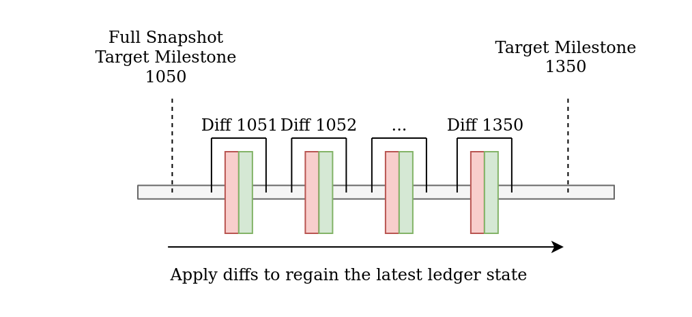

# Summary

This TIP defines a file format for local snapshots which is compatible with Stardust.
The version of the snapshot file format described in this TIP is `Version 2`.

# Motivation

Nodes create local snapshots to produce ledger representations at a point in time of a given milestone to be able to:

* Start up from a recent milestone instead of having to synchronize from the genesis transaction.
* Delete old transaction data below a given milestone.

For Stardust, this file format has to be assimilated to support protocol parameters and to contain the milestone
at the point of the snapshot index in order extract startup metadata from it.

# Detailed design

Since a UTXO based ledger is much larger in size, this TIP proposes two formats for snapshot files:

* A `full` format which represents a complete ledger state.
* A `delta` format which only contains diffs (created and consumed outputs) of milestones from a given milestone index
  onwards.

This separation allows nodes to swiftly create new delta snapshot files, which then can be distributed with a companion
full snapshot file to reconstruct a recent state.

### Formats

> All types are serialized in little-endian

#### Full Ledger State

A full ledger snapshot file contains the UTXOs (`outputs` section) of a node's confirmed
milestone (`Ledger Milestone Index`). The `diffs` contain the diffs to rollback the `outputs` state to regain the ledger
state of the snapshot `Target Milestone Index`.

While the node producing such a full ledger state snapshot could theoretically pre-compute the actual snapshot milestone
state, this is deferred to the consumer of the data to speed up local snapshot creation.

#### Delta Ledger State

A delta ledger state local snapshot only contains the `diffs` of milestones starting from a
given `Full Snapshot Target Milestone Index`. A node consuming such data must know the state of the ledger at `Full Snapshot Target Milestone Index`.

#### Schema

##### Output

Defines an output.

<table>
    <tr>
        <th>Name</th>
        <th>Type</th>
        <th>Description</th>
    </tr>
    <tr>
        <td>Output ID</td>
        <td>Array&lt;byte&gt;[34]</td>
        <td>The ID of the output which is a concatenation of the transaction ID + output index.</td>
    </tr>
    <tr>
        <td>Block ID</td>
        <td>Array&lt;byte&gt;[32]</td>
        <td>The ID of the Block in which the transaction was contained which generated this output.</td>
    </tr>
    <tr>
        <td>Milestone Index Booked</td>
        <td>uint32</td>
        <td>The milestone index at which this output was generated.</td>
    </tr>
    <tr>
        <td>Milestone Timestamp Booked</td>
        <td>uint32</td>
        <td>The UNIX timestamp in seconds of the milestone which produced this output.</td>
    </tr>
    <tr>
        <td>Output Length</td>
        <td>uint32</td>
        <td>Denotes the length of the output.</td>
    </tr>
    <tr>
        <td valign="top">Output <code>oneOf</code></td>
        <td colspan="2">
            

                
BasicOutput

            

            
                                 
                
AliasOutput

            

            
                                 
                
FoundryOutput

            

            
                                 
                
NFTOutput

            

        </td>
    </tr>
</table>

##### Consumed Output

Defines a consumed output.

<table>
    <tr>
        <th>Name</th>
        <th>Type</th>
        <th>Description</th>
    </tr>
    <tr>
        <td>Output</td>
        <td>Array&lt;byte&gt;[Output length]</td>
        <td>The serialized Output (see above).</td>
    </tr>
    <tr>
        <td>Target Transaction ID</td>
        <td>Array&lt;byte&gt;[32]</td>
        <td>The ID of the transaction that spent this output.</td>
    </tr>
</table>

##### Milestone Diff

Defines the diff a milestone produced by listing the created/consumed outputs and the milestone payload itself.

<table>
    <tr>
        <th>Name</th>
        <th>Type</th>
        <th>Description</th>
    </tr>
    <tr>
        <td>Milestone Diff Length</td>
        <td>uint32</td>
        <td>Denotes the length of the milestone diff.</td>
    </tr>
    <tr>
        <td>Milestone Payload Length</td>
        <td>uint32</td>
        <td>Denotes the length of the milestone payload.</td>
    </tr>
    <tr>
        <td>Milestone Payload</td>
        <td>Array&lt;byte&gt;[Milestone Payload length]</td>
        <td>The milestone payload in its serialized binary form.</td>
    </tr>
    <tr>
        <td>
            Treasury Input
            <blockquote>
                only included if milestone contains a receipt
            </blockquote>
        </td>
        <td colspan="2">
            <table>
                <tr>
                    <th>Name</th>
                    <th>Type</th>
                    <th>Description</th>
                </tr>
                <tr>
                    <td>Treasury Input Milestone ID</td>
                    <td>Array&lt;byte&gt;[32]</td>
                    <td>The ID of the milestone this input references.</td>
                </tr>
                <tr>
                    <td>Treasury Input Amount</td>
                    <td>uint64</td>
                    <td>The amount of this treasury input.</td>
                </tr>
            </table>
        </td>
    </tr>
    <tr>
        <td>Created Outputs Count</td>
        <td>uint32</td>
        <td>The amount of outputs generated with this milestone diff.</td>
    </tr>
    <tr>
        <td valign="top">Created Outputs <code>anyOf</code></td>
        <td colspan="2">
            

                
Output

            

        </td>
    </tr>
    <tr>
        <td>Consumed Outputs Count</td>
        <td>uint32</td>
        <td>The amount of outputs consumed with this milestone diff.</td>
    </tr>
    <tr>
        <td valign="top">Consumed Outputs <code>anyOf</code></td>
        <td colspan="2">
            

                
Consumed Output

            

        </td>
    </tr>
</table>

##### Protocol Parameters Milestone Option

This Milestone Option is used to signal to nodes the commencing of new protocol parameters, including new protocol version or PoW difficulty.

<table>
    <tr>
        <th>Name</th>
        <th>Type</th>
        <th>Description</th>
    </tr>
    <tr>
        <td>Milestone Option Type</td>
        <td>byte</td>
        <td>Set to value 1 to denote a Protocol Parameters Milestone Option.</td>
    </tr>
    <tr>
        <td>Target Milestone Index</td>
        <td>uint32</td>
        <td>Then name of the network from which this snapshot was generated from.</td>
    </tr>
    <tr>
        <td>Protocol Version</td>
        <td>byte</td>
        <td>The to be applied protocol version.</td>
    </tr>
    <tr>
        <td>Protocol Parameters</td>
        <td>(uint16)ByteArray</td>
        <td>The protocol parameters in binary, serialized form.</td>
    </tr>
</table>

##### Protocol Parameters

Defines protocol parameters.

<table>
    <tr>
        <th>Name</th>
        <th>Type</th>
        <th>Description</th>
    </tr>
    <tr>
        <td>Protocol Version</td>
        <td>byte</td>
        <td>The version of the protocol.</td>
    </tr>
    <tr>
        <td>Network Name</td>
        <td>(uint8)string</td>
        <td>Then name of the network from which this snapshot was generated from.</td>
    </tr>
    <tr>
        <td>Bech32HRP</td>
        <td>(uint8)string</td>
        <td>The human-readable part of the addresses within the network.</td>
    </tr>
    <tr>
        <td>MinPoWScore</td>
        <td>uint32</td>
        <td>The minimum PoW score.</td>
    </tr>
    <tr>
        <td>BelowMaxDepth</td>
        <td>uint8</td>
        <td>The below max depth parameter.</td>
    </tr>
    <tr>
        <td>RentStructure</td>
        <td colspan="2">
            <table>
                <tr>
                    <th>Name</th>
                    <th>Type</th>
                    <th>Description</th>
                </tr>
                <tr>
                    <td>VByteCost</td>
                    <th>uint32</th>
                    <td>The token price per virtual byte</td>
                </tr>
                <tr>
                    <td>VBFactorData</td>
                    <th>uint8</th>
                    <td>The factor to use for data fields</td>
                </tr>
                <tr>
                    <td>VBFactorKey</td>
                    <th>uint8</th>
                    <td>The factor to use for indexed fields</td>
                </tr>
            </table>
        </td>
    </tr>
    <tr>
        <td>TokenSupply</td>
        <td>uint64</td>
        <td>The token supply.</td>
    </tr>
</table>

##### Full snapshot file format

Defines what a full snapshot file contains.

<table>
    <tr>
        <td><b>Name</b></td>
        <td><b>Type</b></td>
        <td><b>Description</b></td>
    </tr>
    <tr>
        <td>Version</td>
        <td>byte</td>
        <td>Denotes the version of this file format. (Version 2)</td>
    </tr>
    <tr>
        <td>Type</td>
        <td>byte</td>
        <td>Denotes the type of this file format. <b>Value 0</b> denotes a full snapshot.</td>
    </tr>
    <tr>
        <td>Genesis Milestone Index</td>
        <td>uint32</td>
        <td>The index of the genesis milestone of the network.</td>
    </tr>
    <tr>
        <td>Target Milestone Index</td>
        <td>uint32</td>
        <td>The index of the milestone of which the SEPs within the snapshot are from.</td>
    </tr>
    <tr>
        <td>Target Milestone Timestamp</td>
        <td>uint32</td>
        <td>The UNIX timestamp in seconds of the milestone of which the SEPs within the snapshot are from.</td>
    </tr>
    <tr>
        <td>Target Milestone ID</td>
        <td>Array&lt;byte&gt;[32]</td>
        <td>The ID of the milestone of which the SEPs within the snapshot are from.</td>
    </tr>
    <tr>
        <td>Ledger Milestone Index</td>
        <td>uint32</td>
        <td>The index of the milestone of which the UTXOs within the snapshot are from.</td>
    </tr>
    <tr>
        <td>Treasury Output Milestone ID</td>
        <td>Array&lt;byte&gt;[32]</td>
        <td>The milestone ID of the milestone which generated the treasury output.</td>
    </tr>
    <tr>
        <td>Treasury Output Amount</td>
        <td>uint64</td>
        <td>The amount of funds residing on the treasury output.</td>
    </tr>
    <tr>
        <td>Protocol Parameters Milestone Option Length</td>
        <td>uint16</td>
        <td>Denotes the length of the Protocol Parameters Milestone Option.</td>
    </tr>
    <tr>
        <td valign="top">Protocol Parameters Milestone Option</td>
        <td colspan="2">
            

                
Protocol Parameters Milestone Option that is active at the milestone of which the UTXOs within the snapshot are from.

            

        </td>
    </tr>
    <tr>
        <td>Outputs Count</td>
        <td>uint64</td>
        <td>The amount of UTXOs contained within this snapshot.</td>
    </tr>
    <tr>
        <td>Milestone Diffs Count</td>
        <td>uint32</td>
        <td>The amount of milestone diffs contained within this snapshot.</td>
    </tr>
    <tr>
        <td>SEPs Count</td>
        <td>uint16</td>
        <td>The amount of SEPs contained within this snapshot.</td>
    </tr>
    <tr>
        <td valign="top">Outputs</td>
        <td colspan="2">
            

                
Output

            

        </td>
    </tr>
    <tr>
        <td valign="top">Milestone Diffs</td>
        <td colspan="2">
            

                
Milestone Diff

            

        </td>
    </tr>
    <tr>
        <td valign="top">SEPs</td>
        <td colspan="2">
            

                
SEP Array[32]

            

        </td>
    </tr>
</table>

##### Delta snapshot file format

Defines what a delta snapshot contains.

<table>
    <tr>
        <td><b>Name</b></td>
        <td><b>Type</b></td>
        <td><b>Description</b></td>
    </tr>
    <tr>
        <td>Version</td>
        <td>byte</td>
        <td>Denotes the version of this file format. (Version 2)</td>
    </tr>
    <tr>
        <td>Type</td>
        <td>byte</td>
        <td>Denotes the type of this file format. <b>Value 1</b> denotes a delta snapshot.</td>
    </tr>
    <tr>
        <td>Target Milestone Index</td>
        <td>uint32</td>
        <td>The index of the milestone of which the SEPs within the snapshot are from.</td>
    </tr>
    <tr>
        <td>Target Milestone Timestamp</td>
        <td>uint32</td>
        <td>The UNIX timestamp in seconds of the milestone of which the SEPs within the snapshot are from.</td>
    </tr>
    <tr>
        <td>Full Snapshot Target Milestone ID</td>
        <td>Array&lt;byte&gt;[32]</td>
        <td>The ID of the target milestone of the full snapshot this delta snapshot builts up from.</td>
    </tr>
    <tr>
        <td>SEP File Offset</td>
        <td>uint64</td>
        <td>The file offset of the SEPs field. This is used to easily update an existing delta snapshot without parsing its content.</td>
    </tr>
    <tr>
        <td>Milestone Diffs Count</td>
        <td>uint32</td>
        <td>The amount of milestone diffs contained within this snapshot.</td>
    </tr>
    <tr>
        <td>SEPs Count</td>
        <td>uint16</td>
        <td>The amount of SEPs contained within this snapshot.</td>
    </tr>
    <tr>
        <td valign="top">Milestone Diffs</td>
        <td colspan="2">
            

                
Milestone Diff

            

        </td>
    </tr>
    <tr>
        <td valign="top">SEPs</td>
        <td colspan="2">
            

                
SEP Array[32]

            

        </td>
    </tr>
</table>

# Updating an existing Delta snapshot file

When creating a delta snapshot, an existing delta snapshot file can be reused.

In order to do that, the following steps need to be done:
1. Open the existing delta snapshot file.
2. Read the existing delta snapshot file header.
3. Verify that `Version` and `Full Snapshot Target Milestone ID` match between the existing and new delta snapshot.
4. Seek to the position of `Target Milestone Index` and replace it with the new value.
5. Seek to the position of `Target Milestone Timestamp` and replace it with the new value.
6. Seek to the position that is written in the existing `SEP File Offset` and truncate the file at this position.
7. Add the additional `Milestone Diffs` at this position.
8.  Add the new `SEPs`.
9.  Seek to the position of `SEP File Offset` and replace it with the new value.
10. Seek to the position of `Milestone Diffs Count` and replace it with the new value.
11. Seek to the position of `SEPs Count` and replace it with the new value.
12. Close the file.

# Drawbacks

Nodes need to support this new format.

# Rationale and alternatives

* In conjunction with a companion full snapshot, a tool or node can "truncate" the data from a delta snapshot back to a
  single full snapshot. In that case, the `Ledger Milestone Index` and `Target Milestone Index` would be the same. In the
  example above, given the full and delta snapshots, one could produce a new full snapshot for milestone 1350.
* Since snapshots may include millions of UTXOs, code generating such files needs to stream data directly onto disk
  instead of keeping the entire representation in memory. In order to facilitate this, the count denotations for SEPs,
  UTXOs and diffs are at the beginning of the file. This allows code generating snapshot files to only have to seek back
  once after the actual count of elements is known.

# Copyright

Copyright and related rights waived via [CC0](https://creativecommons.org/publicdomain/zero/1.0/).
